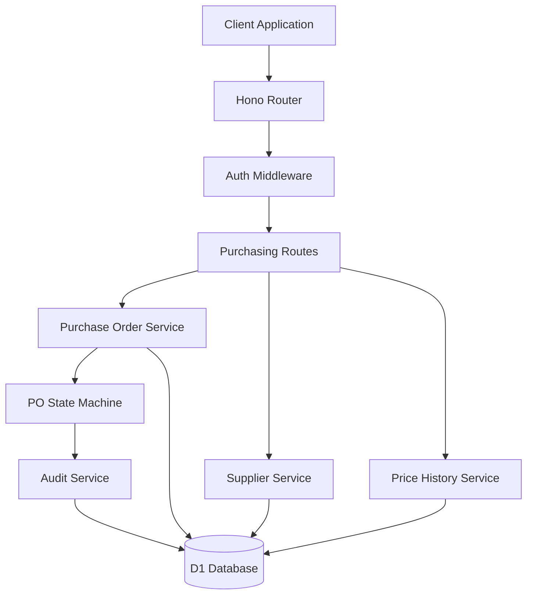

# Design Document: Centralized Purchasing

## Overview

The Centralized Purchasing system enables restaurant organizations to manage bulk procurement through a centralized headquarters model. The system supports the complete purchase order lifecycle from creation through receipt, with automatic price history tracking, supplier management, and comprehensive audit trails.

This design implements a state machine-driven approach for purchase order management, ensuring data consistency and proper workflow enforcement. The system leverages the existing multi-tenant authentication foundation and extends the D1 database schema to support procurement operations.

## Architecture

The purchasing system follows a service-oriented architecture within the Cloudflare Workers environment:



### Core Components

| Component | Responsibility | Technology |
|-----------|---------------|------------|
| **Purchase Order Service** | PO lifecycle management and business logic | TypeScript service layer |
| **PO State Machine** | Workflow enforcement and state transitions | Custom state machine implementation |
| **Supplier Service** | Supplier management and relationship tracking | TypeScript service with D1 |
| **Price History Service** | Historical pricing and suggestions | TypeScript service with D1 |
| **Audit Service** | Change tracking and compliance logging | Shared service from auth system |

## Components and Interfaces

### 1. Purchase Order Service

Manages the complete lifecycle of purchase orders with proper state management:

```typescript
interface PurchaseOrderService {
  createDraft(supplierId: string, tenantId: string): Promise<PurchaseOrder>;
  addLineItem(poId: string, item: POLineItemRequest): Promise<POLineItem>;
  updateLineItem(itemId: string, updates: Partial<POLineItemRequest>): Promise<POLineItem>;
  removeLineItem(itemId: string): Promise<void>;
  approvePO(poId: string, approverId: string): Promise<PurchaseOrder>;
  receivePO(poId: string, receivingData: ReceivingData): Promise<PurchaseOrder>;
  getPOWithItems(poId: string): Promise<PurchaseOrderWithItems>;
}

interface POLineItemRequest {
  productId: string;
  quantityOrdered: number;
  unitPriceCents: number;
  notes?: string;
}

interface ReceivingData {
  receivedItems: Array<{
    poItemId: string;
    quantityReceived: number;
    variance?: string;
    notes?: string;
  }>;
  receivedDate: Date;
  receivedBy: string;
}
```

### 2. Purchase Order State Machine

Enforces proper workflow transitions and business rules:

```typescript
enum POStatus {
  DRAFT = 'DRAFT',
  APPROVED = 'APPROVED', 
  RECEIVED = 'RECEIVED',
  CANCELLED = 'CANCELLED'
}

interface POStateMachine {
  canTransition(from: POStatus, to: POStatus): boolean;
  validateTransition(po: PurchaseOrder, newStatus: POStatus, context: TransitionContext): ValidationResult;
  executeTransition(po: PurchaseOrder, newStatus: POStatus, context: TransitionContext): Promise<PurchaseOrder>;
}

interface TransitionContext {
  userId: string;
  tenantId: string;
  reason?: string;
  metadata?: Record<string, any>;
}
```

**State Transition Rules:**
- **DRAFT → APPROVED**: Requires all line items to have valid quantities and prices
- **APPROVED → RECEIVED**: Requires receiving data and quantities
- **DRAFT → CANCELLED**: Allowed at any time
- **APPROVED → CANCELLED**: Requires authorization and reason
- **RECEIVED → ***: No further transitions allowed (terminal state)

### 3. Supplier Service

Manages supplier relationships and purchasing analytics:

```typescript
interface SupplierService {
  createSupplier(data: CreateSupplierRequest): Promise<Supplier>;
  getSupplier(supplierId: string): Promise<Supplier | null>;
  listSuppliers(tenantId: string): Promise<Supplier[]>;
  updateSupplier(supplierId: string, updates: Partial<UpdateSupplierRequest>): Promise<Supplier>;
  getSupplierAnalytics(supplierId: string, dateRange: DateRange): Promise<SupplierAnalytics>;
}

interface SupplierAnalytics {
  totalSpend: number;
  orderCount: number;
  averageOrderValue: number;
  lastOrderDate: Date;
  topProducts: Array<{
    productId: string;
    productName: string;
    totalQuantity: number;
    totalSpend: number;
  }>;
}
```

### 4. Price History Service

Tracks pricing trends and provides intelligent suggestions:

```typescript
interface PriceHistoryService {
  recordPriceHistory(poItem: POLineItem): Promise<void>;
  getSuggestedPrice(supplierId: string, productId: string): Promise<PriceSuggestion | null>;
  getPriceHistory(supplierId: string, productId: string, limit?: number): Promise<PriceHistoryEntry[]>;
  analyzePriceTrends(productId: string, dateRange: DateRange): Promise<PriceTrendAnalysis>;
}

interface PriceSuggestion {
  suggestedPriceCents: number;
  lastPurchaseDate: Date;
  confidence: 'HIGH' | 'MEDIUM' | 'LOW';
  priceVariance?: number; // Percentage change from historical average
}

interface PriceTrendAnalysis {
  averagePriceCents: number;
  priceVolatility: number;
  trendDirection: 'INCREASING' | 'DECREASING' | 'STABLE';
  dataPoints: number;
}
```

## Data Models

### Database Schema Extensions

The purchasing system extends the existing D1 schema with procurement-specific tables:

```sql
-- Supplier management
CREATE TABLE suppliers (
  id TEXT PRIMARY KEY,
  tenant_id TEXT NOT NULL REFERENCES tenants(id),
  name TEXT NOT NULL,
  contact_email TEXT,
  contact_phone TEXT,
  address TEXT,
  payment_terms TEXT,
  created_at INTEGER NOT NULL,
  updated_at INTEGER NOT NULL,
  
  UNIQUE(tenant_id, name)
);

-- Purchase orders
CREATE TABLE purchase_orders (
  id TEXT PRIMARY KEY,
  tenant_id TEXT NOT NULL REFERENCES tenants(id),
  supplier_id TEXT NOT NULL REFERENCES suppliers(id),
  po_number TEXT, -- Generated on approval
  status TEXT NOT NULL CHECK (status IN ('DRAFT', 'APPROVED', 'RECEIVED', 'CANCELLED')),
  total_cost_cents INTEGER,
  created_by TEXT NOT NULL REFERENCES users(id),
  approved_by TEXT REFERENCES users(id),
  approved_at INTEGER,
  received_by TEXT REFERENCES users(id),
  received_at INTEGER,
  notes TEXT,
  created_at INTEGER NOT NULL,
  updated_at INTEGER NOT NULL,
  
  UNIQUE(tenant_id, po_number) -- PO numbers unique within tenant
);

-- Purchase order line items
CREATE TABLE po_items (
  id TEXT PRIMARY KEY,
  po_id TEXT NOT NULL REFERENCES purchase_orders(id) ON DELETE CASCADE,
  product_id TEXT NOT NULL REFERENCES products(id),
  quantity_ordered INTEGER NOT NULL CHECK (quantity_ordered > 0),
  unit_price_cents INTEGER NOT NULL CHECK (unit_price_cents > 0),
  quantity_received INTEGER DEFAULT 0,
  line_total_cents INTEGER GENERATED ALWAYS AS (quantity_ordered * unit_price_cents),
  notes TEXT,
  created_at INTEGER NOT NULL,
  updated_at INTEGER NOT NULL
);

-- Price history tracking
CREATE TABLE price_history (
  id TEXT PRIMARY KEY,
  tenant_id TEXT NOT NULL REFERENCES tenants(id),
  supplier_id TEXT NOT NULL REFERENCES suppliers(id),
  product_id TEXT NOT NULL REFERENCES products(id),
  unit_price_cents INTEGER NOT NULL,
  po_id TEXT NOT NULL REFERENCES purchase_orders(id),
  recorded_at INTEGER NOT NULL,
  
  INDEX idx_price_history_lookup (tenant_id, supplier_id, product_id, recorded_at DESC)
);

-- Purchase order audit log
CREATE TABLE po_audit_log (
  id TEXT PRIMARY KEY,
  tenant_id TEXT NOT NULL REFERENCES tenants(id),
  po_id TEXT NOT NULL REFERENCES purchase_orders(id),
  action TEXT NOT NULL, -- 'CREATED', 'ITEM_ADDED', 'ITEM_UPDATED', 'APPROVED', 'RECEIVED'
  old_values TEXT, -- JSON
  new_values TEXT, -- JSON
  performed_by TEXT NOT NULL REFERENCES users(id),
  performed_at INTEGER NOT NULL,
  notes TEXT
);
```

### Drizzle Schema Definition

```typescript
export const suppliers = sqliteTable('suppliers', {
  id: text('id').primaryKey(),
  tenantId: text('tenant_id').notNull().references(() => tenants.id),
  name: text('name').notNull(),
  contactEmail: text('contact_email'),
  contactPhone: text('contact_phone'),
  address: text('address'),
  paymentTerms: text('payment_terms'),
  createdAt: integer('created_at').notNull(),
  updatedAt: integer('updated_at').notNull(),
}, (table) => ({
  uniqueName: unique().on(table.tenantId, table.name),
  tenantIdx: index('supplier_tenant_idx').on(table.tenantId),
}));

export const purchaseOrders = sqliteTable('purchase_orders', {
  id: text('id').primaryKey(),
  tenantId: text('tenant_id').notNull().references(() => tenants.id),
  supplierId: text('supplier_id').notNull().references(() => suppliers.id),
  poNumber: text('po_number'),
  status: text('status').notNull(),
  totalCostCents: integer('total_cost_cents'),
  createdBy: text('created_by').notNull().references(() => users.id),
  approvedBy: text('approved_by').references(() => users.id),
  approvedAt: integer('approved_at'),
  receivedBy: text('received_by').references(() => users.id),
  receivedAt: integer('received_at'),
  notes: text('notes'),
  createdAt: integer('created_at').notNull(),
  updatedAt: integer('updated_at').notNull(),
}, (table) => ({
  uniquePONumber: unique().on(table.tenantId, table.poNumber),
  tenantIdx: index('po_tenant_idx').on(table.tenantId),
  statusIdx: index('po_status_idx').on(table.status),
  supplierIdx: index('po_supplier_idx').on(table.supplierId),
}));
```