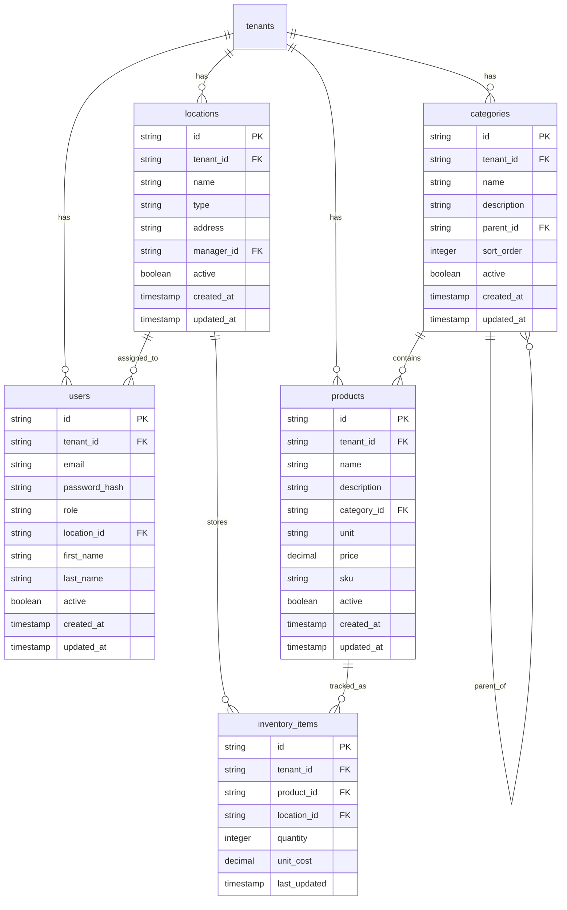

# Design Document

## Overview

This design document outlines the implementation of complete frontend localization and comprehensive CRUD functionality for the GastronomOS restaurant management system. The solution will provide a fully translated Portuguese interface with robust entity management capabilities.

## Architecture

### Frontend Architecture
- **Next.js 16** with App Router for modern React development
- **TypeScript** for type safety and better developer experience
- **Tailwind CSS** for responsive styling
- **Radix UI** components for accessible form elements
- **React Hook Form** for form management and validation
- **Zod** for schema validation
- **SWR** for data fetching and caching
- **Framer Motion** for smooth animations

### Backend Architecture
- **Hono.js** API framework for lightweight, fast endpoints
- **Drizzle ORM** for type-safe database operations
- **SQLite** database with proper indexing
- **Zod** for API request/response validation
- **JWT** for authentication and authorization

### Database Design


## Components and Interfaces

### Translation System Enhancement

#### Extended Translation Files
```typescript
// Enhanced translation structure
interface TranslationMessages {
  common: CommonMessages;
  navigation: NavigationMessages;
  auth: AuthMessages;
  dashboard: DashboardMessages;
  inventory: InventoryMessages;
  purchasing: PurchasingMessages;
  transfers: TransferMessages;
  allocations: AllocationMessages;
  analytics: AnalyticsMessages;
  locations: LocationMessages;
  users: UserMessages;
  settings: SettingsMessages;
  forms: FormMessages;
  validation: ValidationMessages;
  actions: ActionMessages;
  status: StatusMessages;
}
```

#### Form Translation Keys
```typescript
interface FormMessages {
  labels: {
    name: string;
    description: string;
    email: string;
    password: string;
    role: string;
    category: string;
    price: string;
    unit: string;
    address: string;
    phone: string;
    manager: string;
    type: string;
  };
  placeholders: {
    enterName: string;
    enterDescription: string;
    selectCategory: string;
    enterPrice: string;
    searchItems: string;
  };
  buttons: {
    save: string;
    cancel: string;
    delete: string;
    edit: string;
    create: string;
    update: string;
  };
}
```

### CRUD Components Architecture

#### Generic CRUD Hook
```typescript
interface CRUDHook<T> {
  data: T[];
  loading: boolean;
  error: string | null;
  create: (item: Omit<T, 'id'>) => Promise<T>;
  update: (id: string, item: Partial<T>) => Promise<T>;
  delete: (id: string) => Promise<void>;
  refresh: () => void;
}

function useCRUD<T>(endpoint: string): CRUDHook<T> {
  // Implementation with SWR
}
```

#### Modal Form Component
```typescript
interface ModalFormProps<T> {
  isOpen: boolean;
  onClose: () => void;
  onSubmit: (data: T) => Promise<void>;
  initialData?: Partial<T>;
  title: string;
  schema: ZodSchema<T>;
  fields: FormField[];
}

function ModalForm<T>({ isOpen, onClose, onSubmit, initialData, title, schema, fields }: ModalFormProps<T>) {
  // Generic modal form implementation
}
```

#### Data Table Component
```typescript
interface DataTableProps<T> {
  data: T[];
  columns: ColumnDef<T>[];
  loading?: boolean;
  onEdit?: (item: T) => void;
  onDelete?: (item: T) => void;
  onView?: (item: T) => void;
  searchable?: boolean;
  sortable?: boolean;
  pagination?: boolean;
}

function DataTable<T>({ data, columns, loading, onEdit, onDelete, onView, searchable, sortable, pagination }: DataTableProps<T>) {
  // Generic data table with actions
}
```

## Data Models

### Product Model
```typescript
interface Product {
  id: string;
  tenantId: string;
  name: string;
  description?: string;
  categoryId: string;
  unit: string;
  price: number;
  sku?: string;
  active: boolean;
  createdAt: Date;
  updatedAt: Date;
  
  // Relations
  category?: Category;
  inventoryItems?: InventoryItem[];
}
```

### Category Model
```typescript
interface Category {
  id: string;
  tenantId: string;
  name: string;
  description?: string;
  parentId?: string;
  sortOrder: number;
  active: boolean;
  createdAt: Date;
  updatedAt: Date;
  
  // Relations
  parent?: Category;
  children?: Category[];
  products?: Product[];
}
```

### Location Model
```typescript
interface Location {
  id: string;
  tenantId: string;
  name: string;
  type: 'RESTAURANT' | 'COMMISSARY' | 'WAREHOUSE' | 'POP_UP';
  address?: string;
  managerId?: string;
  active: boolean;
  createdAt: Date;
  updatedAt: Date;
  
  // Relations
  manager?: User;
  users?: User[];
  inventoryItems?: InventoryItem[];
}
```

### Enhanced User Model
```typescript
interface User {
  id: string;
  tenantId: string;
  email: string;
  passwordHash: string;
  role: 'ADMIN' | 'MANAGER' | 'STAFF';
  locationId?: string;
  firstName: string;
  lastName: string;
  active: boolean;
  lastLoginAt?: Date;
  createdAt: Date;
  updatedAt: Date;
  
  // Relations
  location?: Location;
  managedLocations?: Location[];
}
```

## Correctness Properties

*A property is a characteristic or behavior that should hold true across all valid executions of a system-essentially, a formal statement about what the system should do. Properties serve as the bridge between human-readable specifications and machine-verifiable correctness guarantees.*

### Property 1: Translation Completeness
*For any* page or component in the application, all user-visible text should have corresponding translation keys in both English and Portuguese translation files.
**Validates: Requirements 1.1, 1.2, 1.3**

### Property 2: CRUD Operation Consistency
*For any* entity (Product, Category, Location, User), performing create, read, update, delete operations should maintain data integrity and proper relationships.
**Validates: Requirements 2.1-2.6, 3.1-3.6, 4.1-4.6, 5.1-5.6**

### Property 3: Form Validation Completeness
*For any* form submission, invalid data should be rejected with appropriate error messages, and valid data should be processed successfully.
**Validates: Requirements 7.1-7.6**

### Property 4: Database Referential Integrity
*For any* database operation, foreign key relationships should be maintained and cascade operations should behave correctly.
**Validates: Requirements 8.1-8.6**

### Property 5: API Response Consistency
*For any* API endpoint, responses should follow consistent structure with proper HTTP status codes and error handling.
**Validates: Requirements 9.1-9.6**

### Property 6: Mobile Responsiveness
*For any* screen size, the interface should remain functional and usable with appropriate touch targets and layouts.
**Validates: Requirements 10.1-10.6**

### Property 7: Permission Enforcement
*For any* user action, the system should enforce role-based permissions and prevent unauthorized operations.
**Validates: Requirements 5.1-5.6, 8.5**

### Property 8: Data Table Functionality
*For any* data table, search, sort, and pagination operations should work correctly and maintain performance.
**Validates: Requirements 6.1-6.6**

## Error Handling

### Client-Side Error Handling
- **Form Validation**: Real-time validation with Zod schemas
- **API Errors**: Centralized error handling with toast notifications
- **Network Errors**: Retry mechanisms and offline indicators
- **Loading States**: Skeleton loaders and progress indicators

### Server-Side Error Handling
- **Validation Errors**: Detailed field-level error responses
- **Database Errors**: Proper constraint violation handling
- **Authentication Errors**: Clear unauthorized access messages
- **Rate Limiting**: Graceful degradation for high traffic

## Testing Strategy

### Unit Testing
- **Component Testing**: React Testing Library for UI components
- **Hook Testing**: Custom hooks with mock data
- **Utility Testing**: Translation functions and form validation
- **API Testing**: Mock API responses and error scenarios

### Property-Based Testing
- **Translation Coverage**: Verify all keys exist in both languages
- **CRUD Operations**: Test create/read/update/delete cycles
- **Form Validation**: Generate random invalid inputs
- **Database Constraints**: Test referential integrity
- **API Consistency**: Verify response formats
- **Permission Checks**: Test role-based access control

### Integration Testing
- **End-to-End Flows**: Complete user workflows
- **Database Operations**: Full CRUD cycles with real data
- **Authentication**: Login/logout and session management
- **Mobile Testing**: Touch interactions and responsive layouts

### Performance Testing
- **Data Table Performance**: Large datasets with pagination
- **API Response Times**: Measure endpoint performance
- **Bundle Size**: Monitor JavaScript bundle growth
- **Memory Usage**: Check for memory leaks in long sessions