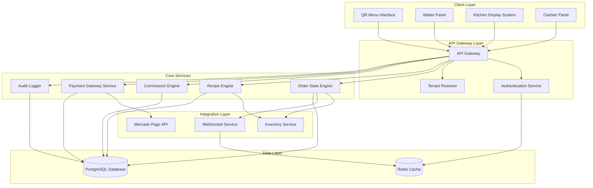
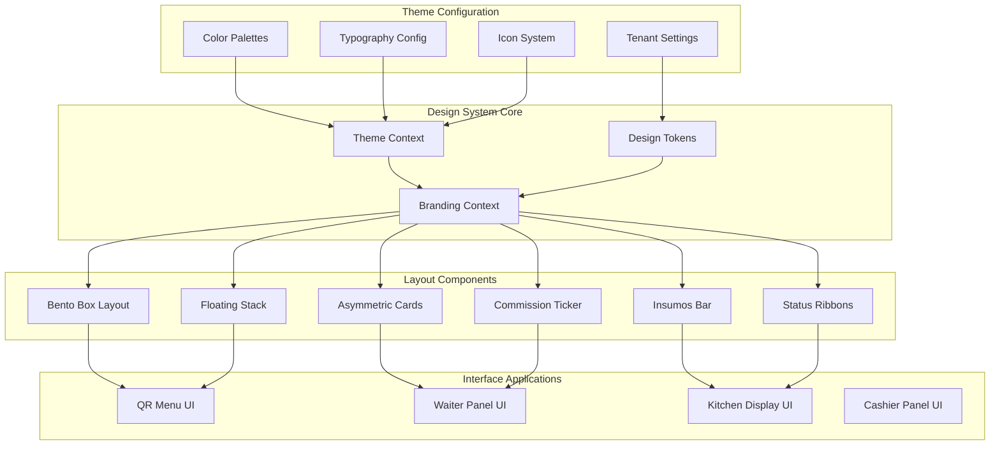

# Design Document: Digital Menu, Kitchen Orchestration & Payment System

## Overview

The Digital Menu, Kitchen Orchestration & Payment System is a comprehensive multi-tenant restaurant management platform that provides end-to-end order management from customer ordering through kitchen preparation to payment processing. The system integrates QR-code digital menus, kitchen display systems, waiter panels, cashier interfaces, and payment processing with automatic inventory consumption and commission tracking.

### Key Features

- **Multi-Interface Order Management**: QR menus, waiter panels, kitchen displays, and cashier interfaces
- **Real-Time Order State Management**: PLACED → PREPARING → READY → DELIVERED workflow
- **Recipe-Driven Inventory Integration**: Automatic ingredient consumption with inventory locking
- **Waiter Commission System**: Configurable commission tracking and reporting
- **Integrated Payment Processing**: Mercado Pago integration with Pix, credit/debit support
- **Split Payment Support**: Multiple customers can pay portions of a single order
- **Multi-Tenant Architecture**: Complete tenant isolation with secure data separation
- **Adaptive Gastronomy Design System**: Comprehensive theming and branding system

### Design System Integration

The system incorporates the **Adaptive Gastronomy** design system, providing:

- **Thematic Architecture**: Semantic token approach with functional names mapped to tenant-chosen palettes
- **Four Color Palette Options**: Bistro Noir, Neon Diner, Organic Garden, and Signature (user-defined)
- **Typography "The Editorial Menu"**: Geometric headings (Syne/Clash Display) with monospaced body text (JetBrains Mono/Space Grotesk)
- **Iconography "Sketch & Wire"**: Custom hand-drawn style icons with variable stroke and incomplete paths
- **Layout "Non-Grid Grid"**: Bento Box dashboards, Floating Stack menus, Asymmetric Cards, Horizontal Insumos Bars, Vertical Status Ribbons, and Live Commission Tickers
- **Integrated Banner Designer**: Canvas API integration with react-easy-crop and automatic background removal

## Architecture

### System Architecture



### Design System Architecture



### Multi-Tenant Architecture

The system enforces strict tenant isolation through:

- **Database-Level Isolation**: All tables include `tenant_id` with row-level security
- **API-Level Validation**: Every request validates tenant access through middleware
- **Configuration Isolation**: Tenant-specific settings including payment gateway credentials
- **Design System Isolation**: Per-tenant theme configurations and branding assets

## Components and Interfaces

### QR Menu Interface

**Purpose**: Customer-facing digital menu accessed via QR code scan

**Key Features**:
- Real-time menu availability based on inventory levels
- Adaptive Gastronomy theming with tenant branding
- Floating Stack layout for menu categories
- Asymmetric Cards for menu items with ingredient breakdown (Insumos Bar)
- Mobile-optimized responsive design

**Components**:
- `MenuCatalog`: Main menu display with category navigation
- `MenuItem`: Individual item display with pricing and availability
- `OrderCart`: Shopping cart with item selection and quantities
- `IngredientBreakdown`: Horizontal Insumos Bar showing ingredient composition
- `OrderSubmission`: Order confirmation and submission interface

### Waiter Panel Interface

**Purpose**: Staff interface for order management and customer service

**Key Features**:
- Real-time order status tracking
- Commission tracking with Live Commission Ticker
- Table management and order assignment
- Bento Box dashboard layout for multi-task management
- Order modification and special instructions

**Components**:
- `OrderDashboard`: Bento Box layout showing assigned orders
- `CommissionTicker`: Live horizontal ticker showing current commission earnings
- `TableManager`: Table assignment and status management
- `OrderDetails`: Detailed order view with modification capabilities
- `CustomerService`: Tools for handling customer requests and modifications

### Kitchen Display System Interface

**Purpose**: Kitchen interface showing order preparation status and workflow

**Key Features**:
- Priority-based order queue display
- Vertical Status Ribbons for order workflow tracking
- Recipe instructions with ingredient requirements
- Preparation time tracking and alerts
- One-touch state transition controls

**Components**:
- `OrderQueue`: Priority-sorted order display
- `StatusRibbons`: Vertical ribbons showing order progression (PLACED → PREPARING → READY)
- `RecipeDisplay`: Detailed preparation instructions with ingredient lists
- `TimerManager`: Preparation time tracking and alerts
- `StateControls`: One-touch buttons for order state transitions

### Cashier Panel Interface

**Purpose**: Payment processing and order completion interface

**Key Features**:
- Multi-payment method support (Pix, credit, debit, manual)
- Split payment processing with real-time balance tracking
- Payment gateway integration with Mercado Pago
- Manual payment logging for external machines
- Order completion and receipt generation

**Components**:
- `PaymentProcessor`: Main payment interface with method selection
- `SplitPaymentManager`: Interface for handling multiple partial payments
- `PixGenerator`: QR code generation for Pix payments
- `ManualPaymentLogger`: Interface for logging external machine payments
- `ReceiptGenerator`: Order completion and receipt printing

## Data Models

### Core Order Management

```typescript
interface Order {
  id: string;
  tenantId: string;
  tableNumber?: string;
  waiterId?: string;
  state: OrderState;
  items: OrderItem[];
  totalAmount: number;
  createdAt: Date;
  updatedAt: Date;
  specialInstructions?: string;
}

enum OrderState {
  PLACED = 'PLACED',
  PREPARING = 'PREPARING', 
  READY = 'READY',
  DELIVERED = 'DELIVERED'
}

interface OrderItem {
  id: string;
  menuItemId: string;
  quantity: number;
  unitPrice: number;
  totalPrice: number;
  specialInstructions?: string;
}

interface MenuItem {
  id: string;
  tenantId: string;
  name: string;
  description: string;
  price: number;
  categoryId: string;
  isAvailable: boolean;
  preparationTime: number; // minutes
  recipe: Recipe;
  imageUrl?: string;
}

interface Recipe {
  id: string;
  menuItemId: string;
  ingredients: RecipeIngredient[];
  instructions: string;
  preparationTime: number;
}

interface RecipeIngredient {
  ingredientId: string;
  quantity: number;
  unit: string;
  isOptional: boolean;
}
```

### Payment Management

```typescript
interface Payment {
  id: string;
  orderId: string;
  tenantId: string;
  method: PaymentMethod;
  amount: number;
  status: PaymentStatus;
  gatewayTransactionId?: string;
  gatewayResponse?: any;
  createdAt: Date;
  processedAt?: Date;
}

enum PaymentMethod {
  PIX = 'PIX',
  CREDIT_CARD = 'CREDIT_CARD',
  DEBIT_CARD = 'DEBIT_CARD',
  MANUAL_CARD = 'MANUAL_CARD',
  CASH = 'CASH'
}

enum PaymentStatus {
  PENDING = 'PENDING',
  PROCESSING = 'PROCESSING',
  COMPLETED = 'COMPLETED',
  FAILED = 'FAILED',
  CANCELLED = 'CANCELLED'
}

interface SplitPayment {
  id: string;
  orderId: string;
  tenantId: string;
  payments: Payment[];
  totalAmount: number;
  paidAmount: number;
  remainingAmount: number;
  isComplete: boolean;
  createdAt: Date;
  completedAt?: Date;
}

interface PaymentGatewayConfig {
  tenantId: string;
  provider: 'MERCADO_PAGO';
  accessToken: string; // encrypted
  publicKey: string;
  webhookUrl: string;
  isActive: boolean;
}
```

### Commission System

```typescript
interface Commission {
  id: string;
  waiterId: string;
  tenantId: string;
  orderId: string;
  orderAmount: number;
  commissionRate: number; // percentage or fixed value
  commissionAmount: number;
  commissionType: CommissionType;
  calculatedAt: Date;
  paidAt?: Date;
}

enum CommissionType {
  PERCENTAGE = 'PERCENTAGE',
  FIXED_VALUE = 'FIXED_VALUE'
}

interface CommissionConfig {
  tenantId: string;
  defaultType: CommissionType;
  defaultRate: number;
  itemSpecificRates: CommissionItemRate[];
}

interface CommissionItemRate {
  menuItemId: string;
  type: CommissionType;
  rate: number;
}

interface CommissionReport {
  waiterId: string;
  tenantId: string;
  period: DateRange;
  totalOrders: number;
  totalSales: number;
  totalCommission: number;
  averageOrderValue: number;
  orders: CommissionOrderSummary[];
}
```

### Design System Models

```typescript
interface ThemeConfig {
  tenantId: string;
  theme: ThemeName;
  palette: ColorPalette;
  customColors?: CustomColorOverrides;
  typography: TypographyConfig;
  bannerDefaults: BannerDefaults;
}

enum ThemeName {
  BISTRO_NOIR = 'bistro-noir',
  NEON_DINER = 'neon-diner', 
  ORGANIC_GARDEN = 'organic-garden',
  SIGNATURE = 'signature'
}

interface ColorPalette {
  primary: string;
  secondary: string;
  accent: string;
  background: string;
  surface: string;
  text: string;
  textSecondary: string;
}

interface TypographyConfig {
  headingFont: 'Syne' | 'Clash Display';
  bodyFont: 'JetBrains Mono' | 'Space Grotesk';
  customFontUrls?: string[];
}

interface BannerDefaults {
  backgroundType: 'solid' | 'gradient' | 'image';
  backgroundColor?: string;
  gradientColors?: [string, string];
  defaultImageUrl?: string;
  textColor: string;
  overlayOpacity: number;
}

interface BrandingAssets {
  tenantId: string;
  logo?: string; // base64 or URL
  favicon?: string;
  bannerImages: BannerImage[];
  customIcons?: CustomIcon[];
}

interface BannerImage {
  id: string;
  name: string;
  url: string;
  width: number;
  height: number;
  category: string;
}
```

### Audit and Compliance

```typescript
interface AuditLog {
  id: string;
  tenantId: string;
  entityType: string; // 'order', 'payment', 'inventory', etc.
  entityId: string;
  action: string;
  oldValue?: any;
  newValue?: any;
  userId?: string;
  userType: 'waiter' | 'kitchen' | 'cashier' | 'manager' | 'system';
  timestamp: Date;
  ipAddress?: string;
  userAgent?: string;
}

interface InventoryConsumption {
  id: string;
  tenantId: string;
  orderId: string;
  ingredientId: string;
  quantityConsumed: number;
  unit: string;
  consumedAt: Date;
  reversedAt?: Date; // if order was cancelled
}
```

## Correctness Properties

*A property is a characteristic or behavior that should hold true across all valid executions of a system-essentially, a formal statement about what the system should do. Properties serve as the bridge between human-readable specifications and machine-verifiable correctness guarantees.*

### Property 1: Order State Machine Enforcement

*For any* order in the system, state transitions must follow the exact sequence PLACED → PREPARING → READY → DELIVERED, and invalid transitions must be rejected.

**Validates: Requirements 2.1, 2.2, 2.3, 2.4**

### Property 2: QR Menu Availability Accuracy

*For any* menu item displayed on the QR menu, the item should only be shown as available if all required ingredients are in sufficient stock, and unavailable items should be marked accordingly.

**Validates: Requirements 1.1, 10.1, 10.2**

### Property 3: Order Creation Consistency

*For any* valid item selection submitted through the QR menu, an order should be created in PLACED state with correct item details and total amount calculation.

**Validates: Requirements 1.2**

### Property 4: Interface Data Display Accuracy

*For any* interface (Waiter Panel, Kitchen Display, Cashier Panel), the displayed orders should match the current database state and show only orders relevant to that interface's role.

**Validates: Requirements 1.3, 1.4, 1.5**

### Property 5: Recipe-Based Inventory Consumption

*For any* order transitioning to PREPARING state, the Recipe Engine should calculate correct ingredient requirements and successfully reserve those ingredients through Inventory Lock.

**Validates: Requirements 3.1, 3.2, 3.3**

### Property 6: Inventory Validation Enforcement

*For any* order with insufficient ingredient inventory, the system should prevent transition to PREPARING state and maintain order in current state.

**Validates: Requirements 3.4**

### Property 7: Stock Alert Generation

*For any* ingredient falling below configured threshold levels, the system should generate appropriate stock alerts.

**Validates: Requirements 3.5**

### Property 8: Commission Calculation Accuracy

*For any* completed order assigned to a waiter, the Commission Engine should calculate commission using the correct rate (percentage or fixed value) and only for DELIVERED orders.

**Validates: Requirements 4.1, 4.2, 4.3, 4.5**

### Property 9: Commission Reporting Completeness

*For any* specified time period and waiter, commission reports should include all completed orders, correct totals, and accurate analytics data.

**Validates: Requirements 4.4, 14.1, 14.2, 14.3, 14.4**

### Property 10: Payment Gateway Integration

*For any* payment request through Mercado Pago, the system should properly format the request, handle the response, and update payment status accordingly.

**Validates: Requirements 5.1, 5.3**

### Property 11: Pix Payment QR Code Generation

*For any* Pix payment request, the system should generate a valid QR code with exactly 15-minute expiration time.

**Validates: Requirements 5.2**

### Property 12: Payment Gateway Security

*For any* payment gateway credentials stored in the system, they should be encrypted in the database and properly validated during configuration.

**Validates: Requirements 5.4, 12.1, 12.2, 12.4**

### Property 13: Manual Payment Validation

*For any* manual payment entry, the system should require all mandatory fields (method, amount, reference) and validate that amounts match order totals.

**Validates: Requirements 6.1, 6.2, 6.3**

### Property 14: Manual Payment Audit Trail

*For any* manual payment logged in the system, complete audit information including timestamp, user identification, and payment details should be recorded.

**Validates: Requirements 6.4, 6.5**

### Property 15: Split Payment Processing

*For any* order with multiple partial payments, the system should track remaining balance in real-time, support mixed payment methods, and prevent completion until total payments equal or exceed order amount.

**Validates: Requirements 7.1, 7.2, 7.3, 7.4**

### Property 16: Overpayment Change Calculation

*For any* payment amount exceeding the order total, the system should calculate and display the correct change amount due.

**Validates: Requirements 7.5**

### Property 17: Tenant Data Isolation

*For any* API request or data operation, the system should enforce strict tenant isolation, validate tenant access, and prevent cross-tenant data access or visibility.

**Validates: Requirements 8.1, 8.2, 8.4**

### Property 18: Tenant Configuration Isolation

*For any* tenant-specific configuration (including payment gateway settings), the system should store and maintain complete isolation between tenants.

**Validates: Requirements 8.3, 8.5**

### Property 19: Comprehensive Audit Logging

*For any* system operation (order state changes, payments, inventory consumption), complete audit logs should be recorded with timestamp, user identification, and operation details.

**Validates: Requirements 9.1, 9.2, 9.3**

### Property 20: Audit Log Immutability

*For any* audit log record created in the system, the record should remain immutable and provide complete audit trails for compliance reporting.

**Validates: Requirements 9.4, 9.5**

### Property 21: Real-Time Menu Availability Updates

*For any* inventory change affecting menu item availability, all QR menu instances should update immediately to reflect current availability status.

**Validates: Requirements 10.3, 13.2**

### Property 22: Manual Availability Override

*For any* menu item with manual availability override, the override should take precedence over automatic inventory-based availability calculations.

**Validates: Requirements 10.4**

### Property 23: Preparation Time Display

*For any* available menu item, the QR menu should display accurate estimated preparation times.

**Validates: Requirements 10.5**

### Property 24: Kitchen Display Order Management

*For any* order in PLACED or PREPARING state, the Kitchen Display should show complete order details, maintain proper sorting by priority and time, and provide functional state transition controls.

**Validates: Requirements 11.1, 11.2, 11.5**

### Property 25: Kitchen Order Progress Tracking

*For any* order item marked complete in the kitchen, the system should update order progress and highlight orders approaching time limits.

**Validates: Requirements 11.3, 11.4**

### Property 26: Payment Gateway Configuration Management

*For any* tenant, the system should support different payment gateway configurations with proper validation and secure storage.

**Validates: Requirements 12.3**

### Property 27: Payment Gateway Fallback

*For any* situation where the payment gateway is unavailable, the system should gracefully fall back to manual payment logging functionality.

**Validates: Requirements 12.5, 15.1**

### Property 28: Real-Time System Synchronization

*For any* order state change or payment status update, all connected interfaces should receive real-time notifications and updates.

**Validates: Requirements 13.1, 13.3**

### Property 29: Connection Management and Recovery

*For any* temporary disconnection, the system should maintain connection state, handle reconnection gracefully, and queue updates for delivery upon reconnection.

**Validates: Requirements 13.4, 13.5**

### Property 30: Commission Adjustment Tracking

*For any* commission adjustment made in the system, complete audit trails should be maintained for tracking and compliance purposes.

**Validates: Requirements 14.5**

### Property 31: System Resilience and Error Handling

*For any* system failure or unavailable service, the system should provide appropriate fallbacks, retry failed operations with exponential backoff, and log errors with sufficient detail for troubleshooting.

**Validates: Requirements 15.2, 15.3, 15.4**

### Property 32: System Health Monitoring

*For any* system health issue or performance degradation, the monitoring system should detect the issue and trigger appropriate alerts.

**Validates: Requirements 15.5**

## Error Handling

### Payment Processing Errors

- **Gateway Timeout**: Automatic retry with exponential backoff (1s, 2s, 4s, 8s, 16s)
- **Gateway Unavailable**: Graceful fallback to manual payment logging with user notification
- **Invalid Credentials**: Clear error messages with configuration guidance
- **Transaction Failures**: Detailed error logging with transaction ID for support

### Inventory System Errors

- **Inventory Service Unavailable**: Allow manual override with prominent warning messages
- **Insufficient Stock**: Prevent order progression with clear messaging to kitchen staff
- **Lock Conflicts**: Retry mechanism with timeout and fallback to manual inventory adjustment
- **Sync Failures**: Queue inventory updates for retry when service recovers

### Order State Management Errors

- **Invalid State Transitions**: Reject with clear error message and current state information
- **Concurrent Modifications**: Optimistic locking with conflict resolution
- **Missing Order Data**: Graceful degradation with partial information display
- **State Sync Failures**: Automatic retry with manual override capability

### Real-Time Communication Errors

- **WebSocket Disconnections**: Automatic reconnection with exponential backoff
- **Message Queue Failures**: Persistent message storage with retry mechanism
- **Broadcast Failures**: Individual interface fallback with status indicators
- **Network Partitions**: Graceful degradation with offline capability

### Multi-Tenant Errors

- **Tenant Resolution Failures**: Clear authentication error with login redirect
- **Cross-Tenant Access Attempts**: Security logging with immediate access denial
- **Configuration Errors**: Validation with detailed error messages and correction guidance
- **Data Isolation Breaches**: Automatic system lockdown with security alert

## Testing Strategy

### Dual Testing Approach

The system employs a comprehensive dual testing strategy combining unit tests and property-based tests to ensure both specific behavior validation and universal correctness guarantees:

**Unit Testing Focus**:
- Specific examples demonstrating correct behavior
- Integration points between system components
- Edge cases and error conditions
- User interface interactions and workflows
- Payment gateway integration scenarios
- Multi-tenant configuration validation

**Property-Based Testing Focus**:
- Universal properties that hold for all valid inputs
- Comprehensive input coverage through randomization
- State machine validation across all possible transitions
- Commission calculations across all rate configurations
- Inventory consumption across all recipe combinations
- Tenant isolation across all data operations

### Property-Based Testing Configuration

**Testing Framework**: Fast-check (JavaScript/TypeScript) for comprehensive property-based testing
**Minimum Iterations**: 100 iterations per property test to ensure statistical confidence
**Test Tagging**: Each property test references its corresponding design document property

**Tag Format**: `Feature: digital-menu-kitchen-payment-system, Property {number}: {property_text}`

**Example Property Test Structure**:
```typescript
// Property 1: Order State Machine Enforcement
fc.assert(fc.property(
  orderGenerator,
  stateTransitionGenerator,
  (order, transition) => {
    const result = orderStateEngine.transition(order, transition);
    return isValidTransition(order.state, transition) 
      ? result.success && result.newState === getExpectedState(order.state, transition)
      : !result.success && result.error.includes('Invalid transition');
  }
), { 
  numRuns: 100,
  verbose: true 
});
```

### Integration Testing Strategy

**Multi-Interface Testing**: Validate real-time synchronization across QR Menu, Waiter Panel, Kitchen Display, and Cashier Panel
**Payment Gateway Testing**: Mock Mercado Pago integration with comprehensive scenario coverage
**Inventory Integration Testing**: Validate Recipe Engine integration with existing inventory system
**Multi-Tenant Testing**: Ensure complete data isolation across tenant boundaries
**Performance Testing**: Load testing for concurrent orders and real-time updates

### Test Data Management

**Tenant Isolation**: Separate test databases per tenant to validate isolation
**Realistic Data Generation**: Menu items, recipes, and inventory data matching production scenarios
**Payment Simulation**: Comprehensive payment scenario generation including edge cases
**Commission Scenarios**: Various commission structures and calculation scenarios
**Error Simulation**: Systematic testing of all error conditions and recovery mechanisms

### Continuous Testing

**Automated Test Execution**: All property tests run on every commit
**Performance Benchmarks**: Automated performance testing with regression detection
**Security Testing**: Automated tenant isolation and security validation
**Integration Monitoring**: Continuous validation of external service integrations
**Compliance Testing**: Automated audit trail and compliance requirement validation