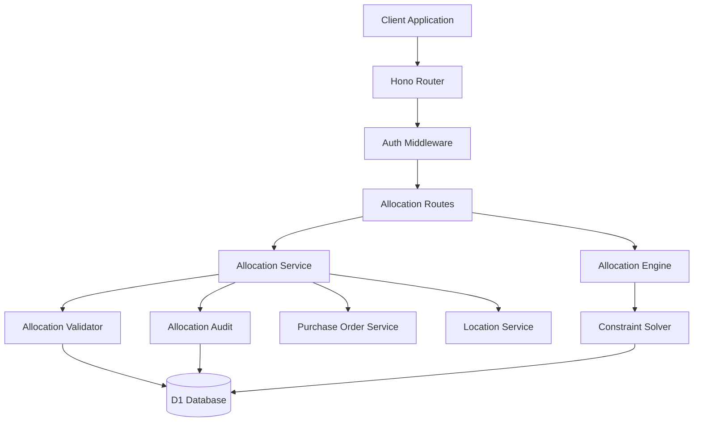

# Design Document: Distributed Allocation

## Overview

The Distributed Allocation system is the core differentiator of GastronomOS, enabling restaurant organizations to virtually split bulk purchases across multiple delivery locations before physical delivery. This system transforms traditional "buy and distribute" logistics into a sophisticated "buy, allocate, then deliver" model that provides complete visibility and control over inventory distribution.

The system implements a constraint-based allocation engine that ensures mathematical consistency (total allocations ≤ purchased quantities) while providing flexible allocation strategies including percentage-based distribution, fixed amounts, and template-driven bulk operations.

## Architecture

The allocation system integrates tightly with the existing purchase order system while maintaining clear separation of concerns:



### Core Components

| Component | Responsibility | Technology |
|-----------|---------------|------------|
| **Allocation Service** | High-level allocation operations and business logic | TypeScript service layer |
| **Allocation Engine** | Mathematical allocation calculations and optimization | TypeScript computational engine |
| **Constraint Solver** | Validation of allocation constraints and business rules | Custom constraint validation |
| **Allocation Validator** | Real-time validation of allocation operations | TypeScript validation service |
| **Allocation Audit** | Change tracking and allocation history | Shared audit service |

## Components and Interfaces

### 1. Allocation Service

Manages the complete allocation lifecycle with proper validation and state management:

```typescript
interface AllocationService {
  createAllocation(request: CreateAllocationRequest): Promise<Allocation>;
  updateAllocation(allocationId: string, updates: UpdateAllocationRequest): Promise<Allocation>;
  deleteAllocation(allocationId: string): Promise<void>;
  getAllocationsForPO(poId: string): Promise<AllocationMatrix>;
  getAllocationsForLocation(locationId: string, filters?: AllocationFilters): Promise<Allocation[]>;
  bulkAllocate(request: BulkAllocationRequest): Promise<BulkAllocationResult>;
  validateAllocationConstraints(poItemId: string, allocations: AllocationInput[]): Promise<ValidationResult>;
}

interface CreateAllocationRequest {
  poItemId: string;
  targetLocationId: string;
  quantityAllocated: number;
  notes?: string;
}

interface AllocationMatrix {
  poId: string;
  lineItems: Array<{
    poItemId: string;
    productName: string;
    quantityOrdered: number;
    allocations: Allocation[];
    totalAllocated: number;
    unallocatedQuantity: number;
  }>;
  totalAllocations: number;
  allocationSummary: LocationAllocationSummary[];
}

interface LocationAllocationSummary {
  locationId: string;
  locationName: string;
  totalAllocatedItems: number;
  totalAllocatedValue: number;
  allocationCount: number;
}
```

### 2. Allocation Engine

Provides mathematical operations and optimization for allocation calculations:

```typescript
interface AllocationEngine {
  calculateOptimalAllocation(
    poItems: POLineItem[], 
    locations: Location[], 
    strategy: AllocationStrategy
  ): Promise<AllocationPlan>;
  
  validateAllocationMath(
    poItemId: string, 
    existingAllocations: Allocation[], 
    newAllocation: AllocationInput
  ): MathValidationResult;
  
  distributeByPercentage(
    totalQuantity: number, 
    locationPercentages: LocationPercentage[]
  ): DistributionResult;
  
  optimizeAllocationBalance(
    currentAllocations: Allocation[], 
    constraints: AllocationConstraints
  ): OptimizationResult;
}

interface AllocationStrategy {
  type: 'PERCENTAGE' | 'FIXED_AMOUNT' | 'TEMPLATE' | 'MANUAL';
  parameters: Record<string, any>;
}

interface AllocationPlan {
  allocations: PlannedAllocation[];
  unallocatedQuantity: number;
  feasible: boolean;
  optimizationScore: number;
}

interface MathValidationResult {
  valid: boolean;
  totalAllocated: number;
  remainingQuantity: number;
  overAllocation?: number;
  errors: string[];
}
```

### 3. Constraint Solver

Enforces business rules and mathematical constraints for allocation operations:

```typescript
interface ConstraintSolver {
  validateConstraints(allocation: AllocationInput, context: AllocationContext): Promise<ConstraintResult>;
  checkQuantityConstraints(poItemId: string, allocations: AllocationInput[]): QuantityConstraintResult;
  validateLocationAccess(userId: string, locationId: string): Promise<AccessConstraintResult>;
  enforceStatusConstraints(allocationId: string, operation: AllocationOperation): StatusConstraintResult;
}

interface AllocationConstraints {
  maxQuantityPerLocation?: number;
  minQuantityPerLocation?: number;
  allowedLocations?: string[];
  requireFullAllocation?: boolean;
  preventOverAllocation: boolean; // Always true
}

interface ConstraintResult {
  valid: boolean;
  violations: ConstraintViolation[];
  warnings: ConstraintWarning[];
}

interface ConstraintViolation {
  type: 'QUANTITY_EXCEEDED' | 'LOCATION_ACCESS' | 'STATUS_INVALID' | 'BUSINESS_RULE';
  message: string;
  field?: string;
  currentValue?: any;
  allowedValue?: any;
}
```

### 4. Bulk Allocation Operations

Supports efficient allocation of multiple line items across multiple locations:

```typescript
interface BulkAllocationRequest {
  poId: string;
  strategy: BulkAllocationStrategy;
  allocations: BulkAllocationInput[];
  validateOnly?: boolean;
}

interface BulkAllocationStrategy {
  type: 'PERCENTAGE_SPLIT' | 'EQUAL_DISTRIBUTION' | 'TEMPLATE_BASED' | 'CUSTOM';
  parameters: {
    locationPercentages?: Record<string, number>; // locationId -> percentage
    templateId?: string;
    customRules?: AllocationRule[];
  };
}

interface BulkAllocationInput {
  poItemId: string;
  locationAllocations: Array<{
    locationId: string;
    quantity: number;
  }>;
}

interface BulkAllocationResult {
  success: boolean;
  createdAllocations: Allocation[];
  failedAllocations: Array<{
    input: BulkAllocationInput;
    errors: string[];
  }>;
  summary: {
    totalProcessed: number;
    successCount: number;
    failureCount: number;
  };
}
```

## Data Models

### Database Schema Extensions

The allocation system extends the D1 schema with allocation-specific tables:

```sql
-- Core allocation table
CREATE TABLE allocations (
  id TEXT PRIMARY KEY,
  tenant_id TEXT NOT NULL REFERENCES tenants(id),
  po_item_id TEXT NOT NULL REFERENCES po_items(id),
  target_location_id TEXT NOT NULL REFERENCES locations(id),
  quantity_allocated INTEGER NOT NULL CHECK (quantity_allocated > 0),
  quantity_received INTEGER DEFAULT 0 CHECK (quantity_received >= 0),
  status TEXT NOT NULL CHECK (status IN ('PENDING', 'SHIPPED', 'RECEIVED', 'CANCELLED')),
  notes TEXT,
  created_by TEXT NOT NULL REFERENCES users(id),
  created_at INTEGER NOT NULL,
  updated_at INTEGER NOT NULL,
  
  -- Ensure no duplicate allocations for same PO item + location
  UNIQUE(po_item_id, target_location_id)
);

-- Allocation templates for bulk operations
CREATE TABLE allocation_templates (
  id TEXT PRIMARY KEY,
  tenant_id TEXT NOT NULL REFERENCES tenants(id),
  name TEXT NOT NULL,
  description TEXT,
  template_data TEXT NOT NULL, -- JSON allocation rules
  created_by TEXT NOT NULL REFERENCES users(id),
  created_at INTEGER NOT NULL,
  
  UNIQUE(tenant_id, name)
);

-- Allocation audit trail
CREATE TABLE allocation_audit_log (
  id TEXT PRIMARY KEY,
  tenant_id TEXT NOT NULL REFERENCES tenants(id),
  allocation_id TEXT NOT NULL REFERENCES allocations(id),
  action TEXT NOT NULL, -- 'CREATED', 'UPDATED', 'DELETED', 'STATUS_CHANGED'
  old_values TEXT, -- JSON
  new_values TEXT, -- JSON
  performed_by TEXT NOT NULL REFERENCES users(id),
  performed_at INTEGER NOT NULL,
  notes TEXT
);

-- Indexes for performance
CREATE INDEX idx_allocations_po_item ON allocations(po_item_id);
CREATE INDEX idx_allocations_location ON allocations(target_location_id);
CREATE INDEX idx_allocations_status ON allocations(status);
CREATE INDEX idx_allocations_tenant_status ON allocations(tenant_id, status);
CREATE INDEX idx_allocation_audit_allocation ON allocation_audit_log(allocation_id);
```

### Drizzle Schema Definition

```typescript
export const allocations = sqliteTable('allocations', {
  id: text('id').primaryKey(),
  tenantId: text('tenant_id').notNull().references(() => tenants.id),
  poItemId: text('po_item_id').notNull().references(() => poItems.id),
  targetLocationId: text('target_location_id').notNull().references(() => locations.id),
  quantityAllocated: integer('quantity_allocated').notNull(),
  quantityReceived: integer('quantity_received').default(0),
  status: text('status').notNull(),
  notes: text('notes'),
  createdBy: text('created_by').notNull().references(() => users.id),
  createdAt: integer('created_at').notNull(),
  updatedAt: integer('updated_at').notNull(),
}, (table) => ({
  uniqueAllocation: unique().on(table.poItemId, table.targetLocationId),
  poItemIdx: index('allocation_po_item_idx').on(table.poItemId),
  locationIdx: index('allocation_location_idx').on(table.targetLocationId),
  statusIdx: index('allocation_status_idx').on(table.status),
  tenantStatusIdx: index('allocation_tenant_status_idx').on(table.tenantId, table.status),
}));
```
## Correctness Properties

*A property is a characteristic or behavior that should hold true across all valid executions of a system—essentially, a formal statement about what the system should do. Properties serve as the bridge between human-readable specifications and machine-verifiable correctness guarantees.*

### Property-Based Testing Analysis

Based on the requirements analysis, the following correctness properties ensure the system maintains mathematical consistency and business rule compliance:

**Property 1: Allocation Quantity Constraints**
*For any* PO line item and its associated allocations, the sum of all allocated quantities should never exceed the ordered quantity, and over-allocation attempts should be rejected with validation errors.
**Validates: Requirements 1.5, 2.1, 2.2**

**Property 2: Allocation Calculation Consistency**
*For any* set of allocations for a PO line item, the calculated totals and remaining unallocated quantities should always be mathematically accurate and consistent with the ordered quantity.
**Validates: Requirements 1.3, 1.4, 3.1, 3.2**

**Property 3: Status-Based Modification Rules**
*For any* allocation, modification operations should only be allowed when the allocation is in PENDING status, and shipped or received allocations should be immutable.
**Validates: Requirements 2.4, 6.1, 6.4**

**Property 4: Location Access Control**
*For any* user attempting allocation operations, they should only be able to allocate to locations they have access to, and view allocations only for their accessible locations.
**Validates: Requirements 2.3, 5.1, 5.2, 5.3, 5.4**

**Property 5: Status Propagation and Transitions**
*For any* allocation status change, the transitions should follow valid state machine rules, and PO status changes should properly propagate to related allocations.
**Validates: Requirements 4.1, 4.2, 4.3, 8.1, 8.4**

**Property 6: Bulk Operation Consistency**
*For any* bulk allocation operation, all individual allocations within the bulk operation should respect the same constraints as individual operations, and partial failures should result in complete rollback.
**Validates: Requirements 7.1, 7.3, 7.5**

**Property 7: Audit Trail Completeness**
*For any* allocation operation (create, update, delete, status change), a complete audit record should be created with proper user context and timestamps.
**Validates: Requirements 4.4, 5.5, 6.2, 6.5**

**Property 8: PO Integration Consistency**
*For any* purchase order, allocation operations should only be possible on approved POs, and PO modifications should properly handle existing allocations.
**Validates: Requirements 8.1, 8.2, 8.3, 8.5**

**Property 9: Unallocated Quantity Management**
*For any* PO line item with partial allocations, unallocated quantities should be accurately calculated and properly handled according to tenant configuration.
**Validates: Requirements 3.3, 3.4, 3.5**

**Property 10: Template and Bulk Distribution Accuracy**
*For any* template-based or percentage-based allocation, the distribution should be mathematically accurate and respect all allocation constraints.
**Validates: Requirements 7.2, 7.4**

## Error Handling

The allocation system implements comprehensive error handling for mathematical and business rule violations:

### Validation Errors (400 Bad Request)
- Over-allocation attempts (quantity exceeds ordered amount)
- Invalid location assignments
- Allocation modifications on shipped/received items
- Bulk operation constraint violations

### Authorization Errors (403 Forbidden)
- Location access violations
- Insufficient permissions for allocation operations
- Cross-tenant allocation attempts

### Conflict Errors (409 Conflict)
- Concurrent allocation modifications
- Status conflicts during allocation operations
- PO status changes conflicting with existing allocations

### Error Response Format
```typescript
interface AllocationErrorResponse {
  error: string;
  message: string;
  code: string;
  details: {
    poItemId?: string;
    locationId?: string;
    requestedQuantity?: number;
    availableQuantity?: number;
    currentAllocations?: AllocationSummary[];
  };
  timestamp: string;
  request_id: string;
}
```

## Testing Strategy

The allocation system requires rigorous testing to ensure mathematical accuracy and business rule compliance.

### Unit Testing Approach
Unit tests focus on specific allocation scenarios and edge cases:
- **Mathematical operations**: Allocation calculations, constraint validation, quantity tracking
- **Status transitions**: Valid and invalid status changes, state machine enforcement
- **Access control**: Location-based permissions, user access validation
- **Error conditions**: Over-allocation attempts, invalid operations, constraint violations
- **Integration points**: PO system integration, audit logging, location management

### Property-Based Testing Configuration
Property tests verify universal mathematical and business properties:
- **Testing framework**: fast-check for TypeScript property-based testing
- **Test iterations**: Minimum 100 iterations per property test
- **Input generation**: Random PO line items, allocations, locations, and user contexts
- **Mathematical invariants**: Allocation constraints that must hold for all valid inputs

Each property test must be tagged with a comment referencing its design document property:
```typescript
// Feature: distributed-allocation, Property 1: Allocation Quantity Constraints
```

### Integration Testing
- **End-to-end allocation workflows**: Complete allocation lifecycle from creation to receipt
- **PO system integration**: Allocation operations with purchase order state changes
- **Bulk operations**: Large-scale allocation operations and performance validation
- **Concurrent operations**: Multiple users performing allocation operations simultaneously

### Mathematical Validation Testing
- **Constraint satisfaction**: All allocation constraints satisfied under all conditions
- **Calculation accuracy**: Mathematical operations produce correct results
- **Invariant preservation**: System invariants maintained through all operations
- **Edge case handling**: Boundary conditions and extreme values handled correctly

The comprehensive testing approach ensures both specific allocation scenarios work correctly (unit tests) and universal mathematical properties hold across all possible inputs (property tests), providing complete coverage for this critical business logic.