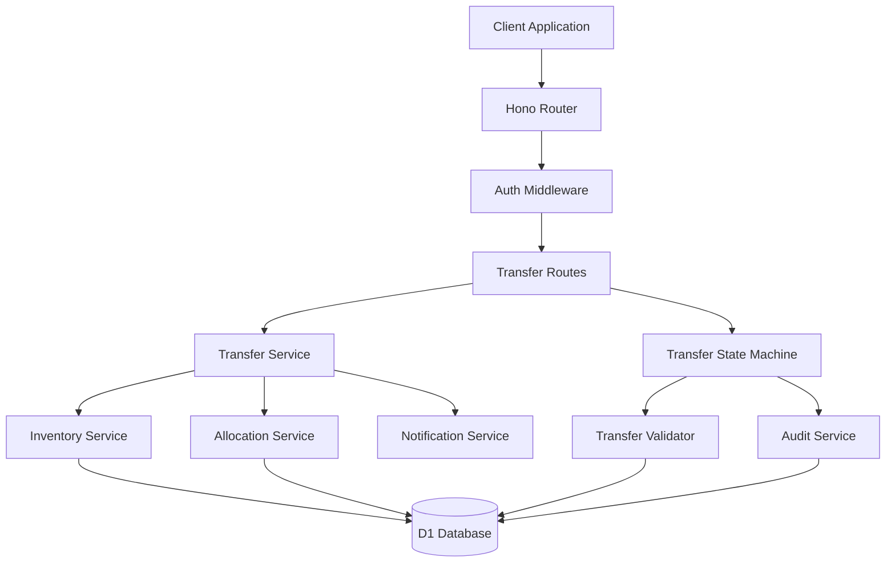

# Design Document: Inter-Location Transfers

## Overview

The Inter-Location Transfers system manages the movement of inventory between restaurant locations within a tenant organization. The system implements a sophisticated state machine-driven workflow with atomic inventory operations, comprehensive variance tracking, and integration with the existing allocation system.

The design emphasizes data consistency through two-phase commit operations, ensuring that inventory quantities remain accurate even during concurrent operations and system failures. The system provides complete audit trails and supports both standard and emergency transfer procedures.

## Architecture

The transfer system integrates with existing inventory and allocation systems while maintaining clear separation of concerns:



### Core Components

| Component | Responsibility | Technology |
|-----------|---------------|------------|
| **Transfer Service** | High-level transfer operations and business logic | TypeScript service layer |
| **Transfer State Machine** | Workflow enforcement and state transitions | Custom state machine implementation |
| **Transfer Validator** | Business rule validation and constraint checking | TypeScript validation service |
| **Inventory Service** | Atomic inventory operations and two-phase commits | Shared service from inventory system |
| **Notification Service** | Transfer status notifications and alerts | TypeScript notification service |

## Components and Interfaces

### 1. Transfer Service

Manages the complete transfer lifecycle with proper validation and state management:

```typescript
interface TransferService {
  createTransferRequest(request: CreateTransferRequest): Promise<Transfer>;
  approveTransfer(transferId: string, approverId: string, notes?: string): Promise<Transfer>;
  rejectTransfer(transferId: string, approverId: string, reason: string): Promise<Transfer>;
  shipTransfer(transferId: string, shipperId: string, shippingNotes?: string): Promise<Transfer>;
  receiveTransfer(transferId: string, receivingData: ReceivingData): Promise<Transfer>;
  cancelTransfer(transferId: string, cancellerId: string, reason: string): Promise<Transfer>;
  getTransfersForLocation(locationId: string, filters?: TransferFilters): Promise<Transfer[]>;
  getTransferDetails(transferId: string): Promise<TransferWithDetails>;
}

interface CreateTransferRequest {
  productId: string;
  sourceLocationId: string;
  destinationLocationId: string;
  quantityRequested: number;
  priority: 'NORMAL' | 'HIGH' | 'EMERGENCY';
  requestedBy: string;
  notes?: string;
  reasonCode?: string;
}

interface ReceivingData {
  quantityReceived: number;
  receivedBy: string;
  receivedAt: Date;
  varianceReason?: string;
  notes?: string;
  damageReport?: string;
}

interface TransferWithDetails {
  transfer: Transfer;
  sourceLocation: Location;
  destinationLocation: Location;
  product: Product;
  auditTrail: TransferAuditEntry[];
  relatedAllocations?: Allocation[];
}
```

### 2. Transfer State Machine

Enforces proper workflow transitions and business rules:

```typescript
enum TransferStatus {
  REQUESTED = 'REQUESTED',
  APPROVED = 'APPROVED',
  SHIPPED = 'SHIPPED',
  RECEIVED = 'RECEIVED',
  CANCELLED = 'CANCELLED'
}

interface TransferStateMachine {
  canTransition(from: TransferStatus, to: TransferStatus): boolean;
  validateTransition(transfer: Transfer, newStatus: TransferStatus, context: TransitionContext): ValidationResult;
  executeTransition(transfer: Transfer, newStatus: TransferStatus, context: TransitionContext): Promise<Transfer>;
  getValidTransitions(currentStatus: TransferStatus): TransferStatus[];
}

interface TransitionContext {
  userId: string;
  tenantId: string;
  reason?: string;
  metadata?: Record<string, any>;
  receivingData?: ReceivingData;
}

interface ValidationResult {
  valid: boolean;
  errors: string[];
  warnings: string[];
  requiredFields?: string[];
}
```

**State Transition Rules:**
- **REQUESTED → APPROVED**: Requires source location authorization
- **REQUESTED → CANCELLED**: Allowed by requester or source location manager
- **APPROVED → SHIPPED**: Requires inventory availability and two-phase commit
- **APPROVED → CANCELLED**: Requires authorization and reason
- **SHIPPED → RECEIVED**: Requires receiving confirmation and variance handling
- **SHIPPED → CANCELLED**: Not allowed (use variance handling instead)

### 3. Transfer Validator

Validates business rules and constraints for transfer operations:

```typescript
interface TransferValidator {
  validateTransferRequest(request: CreateTransferRequest): Promise<ValidationResult>;
  validateInventoryAvailability(productId: string, locationId: string, quantity: number): Promise<AvailabilityResult>;
  validateLocationAccess(userId: string, locationId: string, operation: TransferOperation): Promise<AccessResult>;
  validateTransferConstraints(transfer: Transfer, operation: TransferOperation): Promise<ConstraintResult>;
}

interface AvailabilityResult {
  available: boolean;
  currentQuantity: number;
  availableQuantity: number; // Excluding reserved/in-transit
  reservedQuantity: number;
  inTransitQuantity: number;
}

interface AccessResult {
  hasAccess: boolean;
  requiredRole?: string;
  requiredPermissions?: string[];
  locationRestrictions?: string[];
}

interface ConstraintResult {
  valid: boolean;
  violations: ConstraintViolation[];
  businessRuleFailures: BusinessRuleFailure[];
}

enum TransferOperation {
  CREATE = 'CREATE',
  APPROVE = 'APPROVE',
  SHIP = 'SHIP',
  RECEIVE = 'RECEIVE',
  CANCEL = 'CANCEL'
}
```

### 4. Inventory Integration Service

Handles atomic inventory operations for transfers:

```typescript
interface InventoryIntegrationService {
  executeTransferShipment(transfer: Transfer): Promise<InventoryTransaction>;
  executeTransferReceipt(transfer: Transfer, receivingData: ReceivingData): Promise<InventoryTransaction>;
  rollbackTransferOperation(transactionId: string): Promise<void>;
  reserveInventoryForTransfer(productId: string, locationId: string, quantity: number): Promise<ReservationResult>;
  releaseInventoryReservation(reservationId: string): Promise<void>;
}

interface InventoryTransaction {
  transactionId: string;
  operations: InventoryOperation[];
  timestamp: Date;
  rollbackable: boolean;
}

interface InventoryOperation {
  locationId: string;
  productId: string;
  quantityChange: number;
  operationType: 'DECREMENT_ON_HAND' | 'INCREMENT_IN_TRANSIT' | 'DECREMENT_IN_TRANSIT' | 'INCREMENT_ON_HAND' | 'RECORD_SHRINKAGE';
  previousQuantity: number;
  newQuantity: number;
}

interface ReservationResult {
  reservationId: string;
  reserved: boolean;
  expiresAt: Date;
  reservedQuantity: number;
}
```

## Data Models

### Database Schema Extensions

The transfer system extends the D1 schema with transfer-specific tables:

```sql
-- Transfer requests and tracking
CREATE TABLE transfers (
  id TEXT PRIMARY KEY,
  tenant_id TEXT NOT NULL REFERENCES tenants(id),
  product_id TEXT NOT NULL REFERENCES products(id),
  source_location_id TEXT NOT NULL REFERENCES locations(id),
  destination_location_id TEXT NOT NULL REFERENCES locations(id),
  quantity_requested INTEGER NOT NULL CHECK (quantity_requested > 0),
  quantity_shipped INTEGER DEFAULT 0,
  quantity_received INTEGER DEFAULT 0,
  status TEXT NOT NULL CHECK (status IN ('REQUESTED', 'APPROVED', 'SHIPPED', 'RECEIVED', 'CANCELLED')),
  priority TEXT NOT NULL CHECK (priority IN ('NORMAL', 'HIGH', 'EMERGENCY')),
  requested_by TEXT NOT NULL REFERENCES users(id),
  approved_by TEXT REFERENCES users(id),
  approved_at INTEGER,
  shipped_by TEXT REFERENCES users(id),
  shipped_at INTEGER,
  received_by TEXT REFERENCES users(id),
  received_at INTEGER,
  cancelled_by TEXT REFERENCES users(id),
  cancelled_at INTEGER,
  cancellation_reason TEXT,
  variance_reason TEXT,
  notes TEXT,
  created_at INTEGER NOT NULL,
  updated_at INTEGER NOT NULL,
  
  -- Prevent self-transfers
  CHECK (source_location_id != destination_location_id)
);

-- Transfer audit trail
CREATE TABLE transfer_audit_log (
  id TEXT PRIMARY KEY,
  tenant_id TEXT NOT NULL REFERENCES tenants(id),
  transfer_id TEXT NOT NULL REFERENCES transfers(id),
  action TEXT NOT NULL, -- 'CREATED', 'APPROVED', 'REJECTED', 'SHIPPED', 'RECEIVED', 'CANCELLED'
  old_status TEXT,
  new_status TEXT,
  old_values TEXT, -- JSON
  new_values TEXT, -- JSON
  performed_by TEXT NOT NULL REFERENCES users(id),
  performed_at INTEGER NOT NULL,
  notes TEXT,
  ip_address TEXT,
  user_agent TEXT
);

-- Inventory reservations for pending transfers
CREATE TABLE inventory_reservations (
  id TEXT PRIMARY KEY,
  tenant_id TEXT NOT NULL REFERENCES tenants(id),
  transfer_id TEXT NOT NULL REFERENCES transfers(id),
  product_id TEXT NOT NULL REFERENCES products(id),
  location_id TEXT NOT NULL REFERENCES locations(id),
  quantity_reserved INTEGER NOT NULL CHECK (quantity_reserved > 0),
  reserved_by TEXT NOT NULL REFERENCES users(id),
  reserved_at INTEGER NOT NULL,
  expires_at INTEGER NOT NULL,
  released_at INTEGER,
  
  -- Ensure active reservations are unique per product/location
  UNIQUE(product_id, location_id, transfer_id) WHERE released_at IS NULL
);

-- Transfer-allocation linking for traceability
CREATE TABLE transfer_allocations (
  id TEXT PRIMARY KEY,
  tenant_id TEXT NOT NULL REFERENCES tenants(id),
  transfer_id TEXT NOT NULL REFERENCES transfers(id),
  allocation_id TEXT NOT NULL REFERENCES allocations(id),
  created_at INTEGER NOT NULL,
  
  UNIQUE(transfer_id, allocation_id)
);

-- Performance indexes
CREATE INDEX idx_transfers_tenant_status ON transfers(tenant_id, status);
CREATE INDEX idx_transfers_source_location ON transfers(source_location_id, status);
CREATE INDEX idx_transfers_destination_location ON transfers(destination_location_id, status);
CREATE INDEX idx_transfers_product ON transfers(product_id, status);
CREATE INDEX idx_transfer_audit_transfer ON transfer_audit_log(transfer_id);
CREATE INDEX idx_reservations_location_product ON inventory_reservations(location_id, product_id) WHERE released_at IS NULL;
```

### Drizzle Schema Definition

```typescript
export const transfers = sqliteTable('transfers', {
  id: text('id').primaryKey(),
  tenantId: text('tenant_id').notNull().references(() => tenants.id),
  productId: text('product_id').notNull().references(() => products.id),
  sourceLocationId: text('source_location_id').notNull().references(() => locations.id),
  destinationLocationId: text('destination_location_id').notNull().references(() => locations.id),
  quantityRequested: integer('quantity_requested').notNull(),
  quantityShipped: integer('quantity_shipped').default(0),
  quantityReceived: integer('quantity_received').default(0),
  status: text('status').notNull(),
  priority: text('priority').notNull(),
  requestedBy: text('requested_by').notNull().references(() => users.id),
  approvedBy: text('approved_by').references(() => users.id),
  approvedAt: integer('approved_at'),
  shippedBy: text('shipped_by').references(() => users.id),
  shippedAt: integer('shipped_at'),
  receivedBy: text('received_by').references(() => users.id),
  receivedAt: integer('received_at'),
  cancelledBy: text('cancelled_by').references(() => users.id),
  cancelledAt: integer('cancelled_at'),
  cancellationReason: text('cancellation_reason'),
  varianceReason: text('variance_reason'),
  notes: text('notes'),
  createdAt: integer('created_at').notNull(),
  updatedAt: integer('updated_at').notNull(),
}, (table) => ({
  tenantStatusIdx: index('transfers_tenant_status_idx').on(table.tenantId, table.status),
  sourceLocationIdx: index('transfers_source_location_idx').on(table.sourceLocationId, table.status),
  destinationLocationIdx: index('transfers_destination_location_idx').on(table.destinationLocationId, table.status),
  productIdx: index('transfers_product_idx').on(table.productId, table.status),
  selfTransferCheck: check('no_self_transfer', sql`${table.sourceLocationId} != ${table.destinationLocationId}`),
}));
```
## Correctness Properties

*A property is a characteristic or behavior that should hold true across all valid executions of a system—essentially, a formal statement about what the system should do. Properties serve as the bridge between human-readable specifications and machine-verifiable correctness guarantees.*

### Property-Based Testing Analysis

Based on the requirements analysis, the following correctness properties ensure the system maintains inventory accuracy, workflow integrity, and proper access controls:

**Property 1: Transfer Request Validation**
*For any* transfer request, the system should validate inventory availability, prevent self-transfers, ensure location access, and require all mandatory fields.
**Validates: Requirements 1.1, 1.2, 1.3, 1.4, 1.5**

**Property 2: Authorization and Approval Workflow**
*For any* transfer requiring approval, the system should enforce proper authorization, update status correctly, and send appropriate notifications.
**Validates: Requirements 2.1, 2.2, 2.3, 2.4, 2.5**

**Property 3: Atomic Inventory Operations**
*For any* transfer shipping operation, the system should atomically update source and destination inventories, ensure transaction consistency, and handle rollbacks properly.
**Validates: Requirements 3.1, 3.2, 3.3, 3.4, 3.5**

**Property 4: Transfer Tracking and Audit Trail**
*For any* transfer status change, the system should update status correctly, record audit information, and maintain separate inventory categories.
**Validates: Requirements 4.1, 4.2, 4.3, 4.5**

**Property 5: Receipt and Variance Handling**
*For any* transfer receipt operation, the system should handle quantity matching, record shrinkage properly, and update inventory states correctly.
**Validates: Requirements 5.1, 5.2, 5.3, 5.4, 5.5**

**Property 6: Location-Based Access Control**
*For any* transfer operation, the system should enforce location-based access controls, filter data appropriately, and audit access attempts.
**Validates: Requirements 6.1, 6.2, 6.3, 6.4, 6.5**

**Property 7: Transfer Cancellation Rules**
*For any* transfer cancellation attempt, the system should enforce status-based rules, handle inventory correctly, and maintain proper audit trails.
**Validates: Requirements 7.1, 7.2, 7.3, 7.4, 7.5**

**Property 8: Analytics and Reporting**
*For any* transfer analytics operation, the system should track comprehensive metrics, identify patterns, and provide alerts for anomalies.
**Validates: Requirements 8.1, 8.2, 8.3, 8.4, 8.5**

**Property 9: Allocation System Integration**
*For any* transfer linked to allocations, the system should maintain proper traceability, synchronize status updates, and preserve referential integrity.
**Validates: Requirements 9.1, 9.2, 9.3, 9.4, 9.5**

**Property 10: Emergency Transfer Procedures**
*For any* emergency transfer, the system should expedite processing while maintaining proper controls, notifications, and audit trails.
**Validates: Requirements 10.1, 10.2, 10.3, 10.4, 10.5**

## Error Handling

The transfer system implements comprehensive error handling for all workflow stages and business rule violations:

### Validation Errors (400 Bad Request)
- Insufficient inventory for transfer requests
- Invalid location combinations (self-transfers)
- Missing required fields or invalid data
- Access control violations

### Authorization Errors (403 Forbidden)
- Insufficient permissions for transfer operations
- Location access violations
- Unauthorized approval attempts

### Conflict Errors (409 Conflict)
- Concurrent inventory modifications
- Status conflicts during operations
- Inventory reservation conflicts
- Transaction rollback scenarios

### Business Rule Errors (422 Unprocessable Entity)
- Transfer requests exceeding available inventory
- Invalid status transitions
- Cancellation of shipped transfers
- Variance handling requirement violations

### Error Response Format
```typescript
interface TransferErrorResponse {
  error: string;
  message: string;
  code: string;
  details: {
    transferId?: string;
    productId?: string;
    sourceLocationId?: string;
    destinationLocationId?: string;
    requestedQuantity?: number;
    availableQuantity?: number;
    currentStatus?: TransferStatus;
    validTransitions?: TransferStatus[];
  };
  timestamp: string;
  request_id: string;
}
```

## Testing Strategy

The transfer system requires comprehensive testing to ensure inventory accuracy, workflow integrity, and proper integration with existing systems.

### Unit Testing Approach
Unit tests focus on specific transfer operations and business logic:
- **Transfer validation**: Request validation, inventory checks, access control
- **State machine**: Status transitions, workflow enforcement, business rules
- **Inventory operations**: Atomic updates, two-phase commits, rollback scenarios
- **Variance handling**: Shrinkage calculation, discrepancy reporting, audit trails
- **Access control**: Location-based permissions, user authorization, data filtering
- **Integration points**: Allocation linking, notification sending, audit logging

### Property-Based Testing Configuration
Property tests verify universal transfer properties across diverse scenarios:
- **Testing framework**: fast-check for TypeScript property-based testing
- **Test iterations**: Minimum 100 iterations per property test
- **Input generation**: Random transfers, inventory states, user contexts, and workflow scenarios
- **Invariant verification**: Properties that must hold for all valid transfer operations

Each property test must be tagged with a comment referencing its design document property:
```typescript
// Feature: inter-location-transfers, Property 3: Atomic Inventory Operations
```

### Integration Testing
- **End-to-end workflows**: Complete transfer lifecycle from request to receipt
- **Inventory system integration**: Atomic operations and consistency validation
- **Allocation system integration**: Transfer-allocation linking and status synchronization
- **Notification system**: Transfer status notifications and alert delivery
- **Audit system**: Complete audit trail validation and compliance

### Concurrency Testing
- **Concurrent transfers**: Multiple simultaneous transfers of same products
- **Inventory contention**: Concurrent access to same inventory records
- **Status conflicts**: Simultaneous status changes on same transfers
- **Reservation conflicts**: Multiple reservation attempts on same inventory
- **Transaction isolation**: Proper isolation of concurrent operations

### Performance Testing
- **High-volume transfers**: Large numbers of simultaneous transfer operations
- **Inventory calculations**: Performance of inventory availability calculations
- **Query performance**: Transfer listing and filtering with large datasets
- **Audit trail performance**: Audit logging performance under load
- **Analytics performance**: Transfer analytics calculation with historical data

The comprehensive testing approach ensures both specific transfer scenarios work correctly (unit tests) and universal workflow properties hold across all possible inputs (property tests), providing complete coverage for this critical inventory management system.