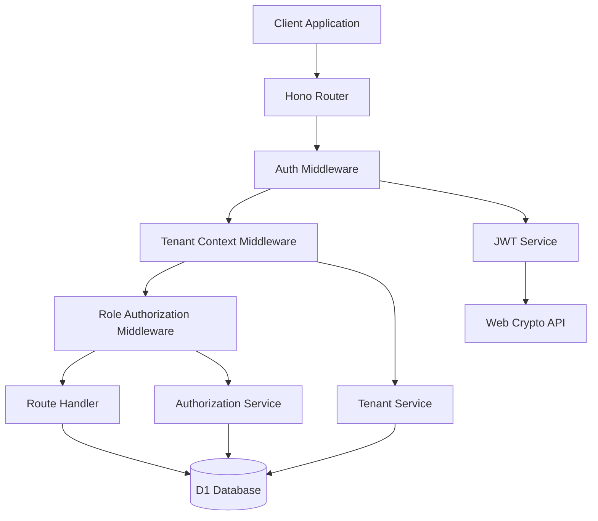

# Design Document: Multi-Tenant Authentication & Authorization

## Overview

The Multi-Tenant Authentication & Authorization system provides the security foundation for GastronomOS, ensuring strict data isolation between restaurant organizations while enabling flexible role-based access control within each tenant. The system leverages Cloudflare Workers for edge-based authentication, D1 for tenant data storage, and JWT tokens for stateless authentication.

This design implements a "shared database, application-level isolation" pattern where all tenants share the same D1 database instance, but strict application-level filtering ensures complete data isolation. This approach provides cost efficiency while maintaining security through rigorous middleware enforcement.

## Architecture

The authentication system follows a layered architecture optimized for Cloudflare Workers:



### Core Components

| Component | Responsibility | Technology |
|-----------|---------------|------------|
| **Auth Middleware** | JWT validation and user context extraction | Hono middleware + Web Crypto API |
| **Tenant Context Middleware** | Tenant resolution and context injection | Custom middleware |
| **Authorization Service** | Role-based permission checking | TypeScript service layer |
| **JWT Service** | Token creation, validation, and claims management | Web Crypto API (native to Workers) |
| **Tenant Service** | Tenant management and data isolation enforcement | Drizzle ORM + D1 |

## Components and Interfaces

### 1. JWT Service

The JWT service handles all token operations using the Web Crypto API available in Cloudflare Workers:

```typescript
interface JWTClaims {
  sub: string;        // user_id
  tenant_id: string;  // tenant identifier
  role: string;       // user role (ADMIN, MANAGER, STAFF)
  location_id?: string; // optional location restriction
  exp: number;        // expiration timestamp
  iat: number;        // issued at timestamp
}

interface JWTService {
  sign(claims: JWTClaims): Promise<string>;
  verify(token: string): Promise<JWTClaims>;
  decode(token: string): JWTClaims | null;
}
```

**Implementation Details:**
- Uses HMAC-SHA256 for signing (HS256 algorithm)
- Signing key stored as Cloudflare Worker secret
- Token expiration set to 24 hours by default
- Claims validation includes expiration and signature verification

### 2. Authentication Middleware

Hono middleware that validates JWT tokens and extracts user context:

```typescript
interface AuthContext {
  user_id: string;
  tenant_id: string;
  role: string;
  location_id?: string;
}

interface AuthMiddleware {
  authenticate(): MiddlewareHandler;
  requireRole(roles: string[]): MiddlewareHandler;
  requireLocation(): MiddlewareHandler;
}
```

**Middleware Chain:**
1. Extract JWT from Authorization header
2. Validate token signature and expiration
3. Extract claims and inject into Hono context
4. Continue to next middleware or return 401/403

### 3. Tenant Service

Manages tenant data and enforces application-level row security:

```typescript
interface TenantService {
  createTenant(data: CreateTenantRequest): Promise<Tenant>;
  getTenant(tenantId: string): Promise<Tenant | null>;
  validateTenantAccess(tenantId: string, userId: string): Promise<boolean>;
  
  // Core isolation method - wraps all database queries
  withTenantContext<T>(
    tenantId: string, 
    operation: (db: DrizzleD1Database) => Promise<T>
  ): Promise<T>;
}
```

**Data Isolation Strategy:**
- Every database query automatically includes `WHERE tenant_id = ?`
- Drizzle ORM wrapper ensures no query can bypass tenant filtering
- Middleware injects tenant context before any database operations

### 4. Authorization Service

Handles role-based access control and permission checking:

```typescript
interface Permission {
  resource: string;    // e.g., 'purchase_orders', 'inventory'
  action: string;      // e.g., 'read', 'write', 'approve'
}

interface AuthorizationService {
  hasPermission(role: string, permission: Permission): boolean;
  canAccessLocation(userId: string, locationId: string): Promise<boolean>;
  getRolePermissions(role: string): Permission[];
}
```

**Role Hierarchy:**
- **ADMIN**: Full access to all tenant data and operations
- **MANAGER**: Location management, inventory operations, user management
- **STAFF**: Basic inventory viewing and updates, limited to assigned location

## Data Models

### Database Schema

The authentication system uses the following core tables in D1:

```sql
-- Tenant organization table
CREATE TABLE tenants (
  id TEXT PRIMARY KEY,
  name TEXT NOT NULL,
  slug TEXT UNIQUE NOT NULL,
  created_at INTEGER NOT NULL,
  settings TEXT -- JSON configuration
);

-- User accounts table
CREATE TABLE users (
  id TEXT PRIMARY KEY,
  tenant_id TEXT NOT NULL REFERENCES tenants(id),
  email TEXT NOT NULL,
  password_hash TEXT NOT NULL,
  role TEXT NOT NULL CHECK (role IN ('ADMIN', 'MANAGER', 'STAFF')),
  location_id TEXT, -- NULL means access to all locations
  created_at INTEGER NOT NULL,
  updated_at INTEGER NOT NULL,
  
  UNIQUE(tenant_id, email) -- Email unique within tenant
);

-- Location table for multi-location tenants
CREATE TABLE locations (
  id TEXT PRIMARY KEY,
  tenant_id TEXT NOT NULL REFERENCES tenants(id),
  name TEXT NOT NULL,
  type TEXT NOT NULL CHECK (type IN ('COMMISSARY', 'RESTAURANT', 'POP_UP')),
  address TEXT,
  created_at INTEGER NOT NULL
);

-- Audit log for security events
CREATE TABLE auth_audit_log (
  id TEXT PRIMARY KEY,
  tenant_id TEXT,
  user_id TEXT,
  event_type TEXT NOT NULL, -- 'LOGIN', 'LOGIN_FAILED', 'ACCESS_DENIED'
  resource TEXT,
  ip_address TEXT,
  user_agent TEXT,
  created_at INTEGER NOT NULL
);
```

### Drizzle Schema Definition

```typescript
export const tenants = sqliteTable('tenants', {
  id: text('id').primaryKey(),
  name: text('name').notNull(),
  slug: text('slug').notNull().unique(),
  createdAt: integer('created_at').notNull(),
  settings: text('settings', { mode: 'json' }),
});

export const users = sqliteTable('users', {
  id: text('id').primaryKey(),
  tenantId: text('tenant_id').notNull().references(() => tenants.id),
  email: text('email').notNull(),
  passwordHash: text('password_hash').notNull(),
  role: text('role').notNull(),
  locationId: text('location_id'),
  createdAt: integer('created_at').notNull(),
  updatedAt: integer('updated_at').notNull(),
}, (table) => ({
  uniqueEmail: unique().on(table.tenantId, table.email),
  tenantIdx: index('user_tenant_idx').on(table.tenantId),
  emailIdx: index('user_email_idx').on(table.email),
}));
```

## Correctness Properties

*A property is a characteristic or behavior that should hold true across all valid executions of a system—essentially, a formal statement about what the system should do. Properties serve as the bridge between human-readable specifications and machine-verifiable correctness guarantees.*

Now I need to analyze the acceptance criteria to determine which ones can be tested as properties.

### Property-Based Testing Analysis

Based on the requirements analysis, the following correctness properties ensure the system maintains security and isolation guarantees:

**Property 1: Tenant Data Isolation**
*For any* database query executed by an authenticated user, the results should only contain data where the tenant_id matches the user's tenant, and no query should ever return data from multiple tenants simultaneously.
**Validates: Requirements 3.1, 3.2, 3.5**

**Property 2: Cross-Tenant Access Prevention**
*For any* attempt to access data or resources, if the target resource belongs to a different tenant than the authenticated user, the system should deny access and return an authorization error.
**Validates: Requirements 3.3, 5.3**

**Property 3: JWT Structure and Claims**
*For any* generated JWT token, it should contain all required claims (tenant_id, user_id, role, expiration time) and the claims should be extractable and available in the request context.
**Validates: Requirements 2.5, 6.1, 6.4**

**Property 4: JWT Validation and Security**
*For any* JWT token validation attempt, expired or invalid tokens should be rejected with authentication errors, while valid tokens should pass signature and expiration verification.
**Validates: Requirements 6.2, 6.3, 2.4**

**Property 5: Role-Based Authorization**
*For any* user attempting to perform an action, the system should verify the user's role includes the required permissions, and only allow the action if authorization succeeds.
**Validates: Requirements 4.2, 7.2**

**Property 6: Location-Based Access Control**
*For any* user assigned to a specific location, all data queries should be filtered by both tenant_id and location_id, and access to other locations should be denied.
**Validates: Requirements 5.1, 5.2, 7.3**

**Property 7: Tenant and User Uniqueness**
*For any* tenant slug or user email within a tenant, the system should enforce uniqueness constraints and reject duplicate values.
**Validates: Requirements 1.2, 2.1**

**Property 8: Password Security**
*For any* user registration or password update, the system should never store passwords in plaintext and should use secure hashing algorithms.
**Validates: Requirements 2.2**

**Property 9: Comprehensive Audit Logging**
*For any* authentication event, authorization decision, or sensitive operation, the system should create immutable audit log entries with complete context information.
**Validates: Requirements 8.1, 8.2, 8.3, 8.4, 8.5**

**Property 10: Role Validation**
*For any* user role assignment, the system should only accept valid role types (ADMIN, MANAGER, STAFF) and enforce appropriate permission levels for each role.
**Validates: Requirements 4.1, 4.3, 4.4, 4.5**

## Error Handling

The authentication system implements comprehensive error handling with specific HTTP status codes and descriptive messages:

### Authentication Errors (401 Unauthorized)
- Missing or malformed JWT tokens
- Expired JWT tokens
- Invalid JWT signatures
- Invalid login credentials

### Authorization Errors (403 Forbidden)
- Insufficient role permissions
- Cross-tenant data access attempts
- Location access violations
- Resource-specific permission failures

### Validation Errors (400 Bad Request)
- Invalid role assignments
- Duplicate tenant slugs
- Duplicate user emails within tenant
- Malformed request data

### Error Response Format
```typescript
interface ErrorResponse {
  error: string;
  message: string;
  code: string;
  timestamp: string;
  request_id: string;
}
```

## Testing Strategy

The authentication system requires comprehensive testing using both unit tests and property-based tests to ensure security guarantees.

### Unit Testing Approach
Unit tests focus on specific examples and edge cases:
- **Authentication flows**: Valid/invalid login scenarios
- **JWT operations**: Token creation, validation, expiration handling
- **Role permissions**: Specific permission checks for each role type
- **Error conditions**: Malformed requests, missing headers, invalid data
- **Database operations**: Tenant filtering, user lookups, audit logging

### Property-Based Testing Configuration
Property tests verify universal security properties across all inputs:
- **Testing framework**: fast-check for TypeScript property-based testing
- **Test iterations**: Minimum 100 iterations per property test
- **Input generation**: Random tenants, users, roles, locations, and JWT tokens
- **Invariant verification**: Security properties that must hold for all valid inputs

Each property test must be tagged with a comment referencing its design document property:
```typescript
// Feature: multi-tenant-auth, Property 1: Tenant Data Isolation
```

### Integration Testing
- **Middleware chain**: Complete authentication and authorization flow
- **Database isolation**: Cross-tenant access prevention
- **API endpoints**: Protected route access with various user contexts
- **Audit logging**: Verification of security event logging

### Security Testing
- **Cross-tenant attacks**: Attempts to access other tenant data
- **Privilege escalation**: Attempts to perform unauthorized actions
- **Token manipulation**: Invalid JWT modifications and replay attacks
- **SQL injection**: Malicious input in tenant/user queries (though Drizzle ORM provides protection)

The dual testing approach ensures both concrete security scenarios work correctly (unit tests) and universal security properties hold across all possible inputs (property tests), providing comprehensive coverage for this critical security foundation.