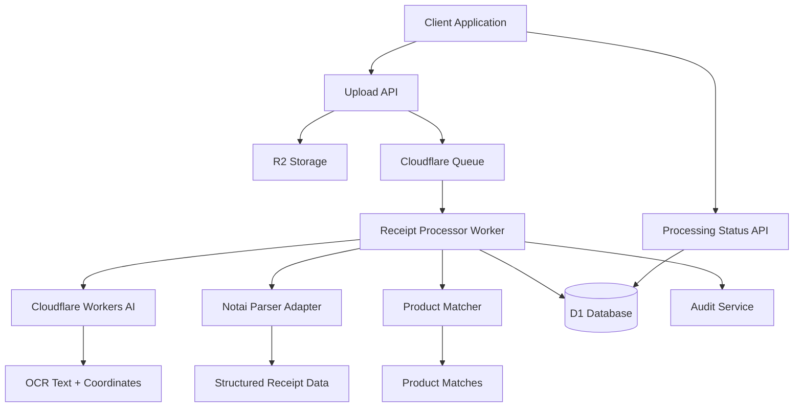

# Design Document: Receipt Scanning (Notai Adaptation)

## Overview

The Receipt Scanning system adapts the proven heuristic parsing logic from the open-source Notai repository into GastronomOS's serverless edge architecture. This system transforms receipt images into structured data through a sophisticated pipeline combining Cloudflare Workers AI for OCR, adapted Notai parsing algorithms, and intelligent product matching against tenant catalogs.

The design prioritizes privacy, cost-efficiency, and accuracy by processing images entirely within Cloudflare's edge network, avoiding expensive third-party OCR services while maintaining high parsing accuracy through battle-tested heuristics.

## Architecture

The receipt scanning system implements an asynchronous pipeline architecture optimized for edge processing:



### Core Components

| Component | Responsibility | Technology |
|-----------|---------------|------------|
| **Upload Service** | Secure image upload and presigned URL generation | Hono + R2 presigned URLs |
| **Receipt Processor Worker** | Asynchronous receipt processing orchestration | Cloudflare Workers + Queues |
| **Notai Parser Adapter** | Adapted heuristic parsing from Notai repository | TypeScript port of Notai logic |
| **OCR Service** | AI-powered text extraction from images | Cloudflare Workers AI (Vision models) |
| **Product Matcher** | Fuzzy matching against tenant product catalogs | Levenshtein distance algorithm |
| **Receipt Storage Service** | Structured data persistence and retrieval | D1 database + R2 blob storage |

## Components and Interfaces

### 1. Upload Service

Manages secure receipt image uploads with proper access controls:

```typescript
interface UploadService {
  generateUploadURL(tenantId: string, userId: string): Promise<UploadURLResponse>;
  validateImageFile(file: File): ValidationResult;
  confirmUpload(uploadId: string, metadata: UploadMetadata): Promise<UploadConfirmation>;
  getUploadStatus(uploadId: string): Promise<UploadStatus>;
}

interface UploadURLResponse {
  uploadUrl: string;
  uploadId: string;
  expiresAt: Date;
  maxFileSize: number;
  allowedTypes: string[];
}

interface UploadMetadata {
  fileName: string;
  fileSize: number;
  contentType: string;
  checksum?: string;
}

interface UploadConfirmation {
  uploadId: string;
  r2Key: string;
  processingJobId: string;
  estimatedProcessingTime: number;
}
```

### 2. Receipt Processor Worker

Orchestrates the complete receipt processing pipeline:

```typescript
interface ReceiptProcessorWorker {
  processReceipt(job: ReceiptProcessingJob): Promise<ProcessingResult>;
  retryFailedProcessing(jobId: string, retryCount: number): Promise<ProcessingResult>;
  updateProcessingStatus(jobId: string, status: ProcessingStatus): Promise<void>;
}

interface ReceiptProcessingJob {
  jobId: string;
  tenantId: string;
  userId: string;
  r2Key: string;
  uploadMetadata: UploadMetadata;
  processingOptions: ProcessingOptions;
}

interface ProcessingOptions {
  ocrModel: string;
  parsingStrategy: 'AGGRESSIVE' | 'CONSERVATIVE' | 'ADAPTIVE';
  productMatchingThreshold: number;
  requireManualReview: boolean;
}

interface ProcessingResult {
  success: boolean;
  receiptData?: StructuredReceiptData;
  errors: ProcessingError[];
  processingStats: ProcessingStatistics;
  requiresManualReview: boolean;
}
```

### 3. Notai Parser Adapter

Adapts the Notai repository's parsing logic for serverless execution:

```typescript
interface NotaiParserAdapter {
  parseReceiptText(ocrText: string, coordinates?: BoundingBox[]): Promise<ParsedReceiptData>;
  extractTransactionDate(text: string): Date | null;
  extractTotalAmount(text: string): number | null;
  extractVendorName(text: string, coordinates?: BoundingBox[]): string | null;
  extractLineItems(text: string): LineItemCandidate[];
}

interface ParsedReceiptData {
  vendor: VendorInfo | null;
  transactionDate: Date | null;
  totalAmount: number | null;
  subtotal: number | null;
  tax: number | null;
  lineItems: LineItemCandidate[];
  confidence: ParseConfidence;
  parsingMetadata: ParsingMetadata;
}

interface LineItemCandidate {
  description: string;
  quantity: number | null;
  unitPrice: number | null;
  totalPrice: number | null;
  confidence: number;
  rawText: string;
  coordinates?: BoundingBox;
}

interface ParseConfidence {
  overall: number; // 0-1 confidence score
  vendor: number;
  date: number;
  total: number;
  lineItems: number;
}
```

### 4. OCR Service

Interfaces with Cloudflare Workers AI for text extraction:

```typescript
interface OCRService {
  extractText(imageBuffer: ArrayBuffer, options: OCROptions): Promise<OCRResult>;
  extractTextWithCoordinates(imageBuffer: ArrayBuffer): Promise<OCRResultWithCoordinates>;
  validateImageFormat(buffer: ArrayBuffer): boolean;
}

interface OCROptions {
  model: 'llama-vision' | 'resnet-ocr';
  language: string;
  enhanceQuality: boolean;
  extractCoordinates: boolean;
}

interface OCRResult {
  text: string;
  confidence: number;
  processingTime: number;
  model: string;
}

interface OCRResultWithCoordinates extends OCRResult {
  textBlocks: TextBlock[];
  boundingBoxes: BoundingBox[];
}

interface TextBlock {
  text: string;
  confidence: number;
  boundingBox: BoundingBox;
}

interface BoundingBox {
  x: number;
  y: number;
  width: number;
  height: number;
}
```

### 5. Product Matcher

Performs intelligent matching of receipt items to product catalog:

```typescript
interface ProductMatcher {
  matchLineItems(
    lineItems: LineItemCandidate[], 
    productCatalog: Product[], 
    options: MatchingOptions
  ): Promise<ProductMatchResult[]>;
  
  fuzzyMatch(description: string, products: Product[]): ProductMatch[];
  calculateSimilarity(text1: string, text2: string): number;
  rankMatches(matches: ProductMatch[]): ProductMatch[];
}

interface MatchingOptions {
  similarityThreshold: number; // 0-1, minimum similarity for matches
  maxMatches: number; // Maximum number of matches to return per item
  useAliases: boolean; // Whether to match against product aliases
  categoryHints?: string[]; // Product categories to prioritize
}

interface ProductMatchResult {
  lineItem: LineItemCandidate;
  matches: ProductMatch[];
  bestMatch: ProductMatch | null;
  requiresManualReview: boolean;
  confidence: number;
}

interface ProductMatch {
  product: Product;
  similarity: number;
  matchType: 'EXACT' | 'FUZZY' | 'ALIAS' | 'CATEGORY';
  matchedField: 'name' | 'sku' | 'alias' | 'description';
  confidence: number;
}
```

## Data Models

### Database Schema Extensions

The receipt scanning system extends the D1 schema with receipt processing tables:

```sql
-- Receipt processing jobs
CREATE TABLE receipt_processing_jobs (
  id TEXT PRIMARY KEY,
  tenant_id TEXT NOT NULL REFERENCES tenants(id),
  user_id TEXT NOT NULL REFERENCES users(id),
  r2_key TEXT NOT NULL,
  status TEXT NOT NULL CHECK (status IN ('PENDING', 'PROCESSING', 'COMPLETED', 'FAILED', 'REQUIRES_REVIEW')),
  processing_options TEXT, -- JSON
  created_at INTEGER NOT NULL,
  started_at INTEGER,
  completed_at INTEGER,
  retry_count INTEGER DEFAULT 0,
  error_message TEXT
);

-- Processed receipt data
CREATE TABLE receipts (
  id TEXT PRIMARY KEY,
  tenant_id TEXT NOT NULL REFERENCES tenants(id),
  processing_job_id TEXT NOT NULL REFERENCES receipt_processing_jobs(id),
  r2_key TEXT NOT NULL, -- Original image
  vendor_name TEXT,
  transaction_date INTEGER,
  total_amount_cents INTEGER,
  subtotal_cents INTEGER,
  tax_cents INTEGER,
  currency TEXT DEFAULT 'USD',
  confidence_score REAL,
  requires_manual_review BOOLEAN DEFAULT FALSE,
  linked_po_id TEXT REFERENCES purchase_orders(id),
  created_at INTEGER NOT NULL,
  updated_at INTEGER NOT NULL
);

-- Receipt line items
CREATE TABLE receipt_line_items (
  id TEXT PRIMARY KEY,
  receipt_id TEXT NOT NULL REFERENCES receipts(id) ON DELETE CASCADE,
  description TEXT NOT NULL,
  quantity REAL,
  unit_price_cents INTEGER,
  total_price_cents INTEGER,
  matched_product_id TEXT REFERENCES products(id),
  match_confidence REAL,
  requires_manual_review BOOLEAN DEFAULT FALSE,
  raw_text TEXT,
  coordinates TEXT, -- JSON bounding box
  created_at INTEGER NOT NULL
);

-- Product matching results for manual review
CREATE TABLE product_match_candidates (
  id TEXT PRIMARY KEY,
  receipt_line_item_id TEXT NOT NULL REFERENCES receipt_line_items(id) ON DELETE CASCADE,
  product_id TEXT NOT NULL REFERENCES products(id),
  similarity_score REAL NOT NULL,
  match_type TEXT NOT NULL,
  confidence REAL NOT NULL,
  created_at INTEGER NOT NULL
);

-- Receipt processing statistics
CREATE TABLE receipt_processing_stats (
  id TEXT PRIMARY KEY,
  tenant_id TEXT NOT NULL REFERENCES tenants(id),
  date_bucket TEXT NOT NULL, -- YYYY-MM-DD for daily stats
  total_processed INTEGER DEFAULT 0,
  successful_processed INTEGER DEFAULT 0,
  failed_processed INTEGER DEFAULT 0,
  manual_review_required INTEGER DEFAULT 0,
  avg_processing_time_ms INTEGER DEFAULT 0,
  avg_confidence_score REAL DEFAULT 0,
  created_at INTEGER NOT NULL,
  updated_at INTEGER NOT NULL,
  
  UNIQUE(tenant_id, date_bucket)
);

-- Indexes for performance
CREATE INDEX idx_receipt_jobs_tenant_status ON receipt_processing_jobs(tenant_id, status);
CREATE INDEX idx_receipts_tenant_date ON receipts(tenant_id, transaction_date);
CREATE INDEX idx_receipt_items_receipt ON receipt_line_items(receipt_id);
CREATE INDEX idx_product_matches_line_item ON product_match_candidates(receipt_line_item_id);
```

### Drizzle Schema Definition

```typescript
export const receiptProcessingJobs = sqliteTable('receipt_processing_jobs', {
  id: text('id').primaryKey(),
  tenantId: text('tenant_id').notNull().references(() => tenants.id),
  userId: text('user_id').notNull().references(() => users.id),
  r2Key: text('r2_key').notNull(),
  status: text('status').notNull(),
  processingOptions: text('processing_options', { mode: 'json' }),
  createdAt: integer('created_at').notNull(),
  startedAt: integer('started_at'),
  completedAt: integer('completed_at'),
  retryCount: integer('retry_count').default(0),
  errorMessage: text('error_message'),
}, (table) => ({
  tenantStatusIdx: index('receipt_jobs_tenant_status_idx').on(table.tenantId, table.status),
  userIdx: index('receipt_jobs_user_idx').on(table.userId),
}));

export const receipts = sqliteTable('receipts', {
  id: text('id').primaryKey(),
  tenantId: text('tenant_id').notNull().references(() => tenants.id),
  processingJobId: text('processing_job_id').notNull().references(() => receiptProcessingJobs.id),
  r2Key: text('r2_key').notNull(),
  vendorName: text('vendor_name'),
  transactionDate: integer('transaction_date'),
  totalAmountCents: integer('total_amount_cents'),
  subtotalCents: integer('subtotal_cents'),
  taxCents: integer('tax_cents'),
  currency: text('currency').default('USD'),
  confidenceScore: real('confidence_score'),
  requiresManualReview: integer('requires_manual_review', { mode: 'boolean' }).default(false),
  linkedPoId: text('linked_po_id').references(() => purchaseOrders.id),
  createdAt: integer('created_at').notNull(),
  updatedAt: integer('updated_at').notNull(),
}, (table) => ({
  tenantDateIdx: index('receipts_tenant_date_idx').on(table.tenantId, table.transactionDate),
  jobIdx: index('receipts_job_idx').on(table.processingJobId),
}));
```
## Correctness Properties

*A property is a characteristic or behavior that should hold true across all valid executions of a system—essentially, a formal statement about what the system should do. Properties serve as the bridge between human-readable specifications and machine-verifiable correctness guarantees.*

### Property-Based Testing Analysis

Based on the requirements analysis, the following correctness properties ensure the system maintains processing accuracy, security, and data integrity:

**Property 1: Secure Upload and Access Control**
*For any* receipt image upload request, the system should generate unique presigned URLs with proper expiration times, and all image access should require valid authentication and authorization.
**Validates: Requirements 1.1, 1.2, 1.5, 8.4**

**Property 2: Asynchronous Processing Pipeline**
*For any* completed image upload, the system should trigger background processing, provide accurate status updates, and handle failures with proper retry logic.
**Validates: Requirements 2.1, 2.3, 2.4, 2.5**

**Property 3: OCR Processing Consistency**
*For any* receipt image processed through OCR, the system should use specified AI models, extract both text and coordinates when available, and handle various image formats correctly.
**Validates: Requirements 3.1, 3.2, 3.4**

**Property 4: Heuristic Parsing Accuracy**
*For any* OCR text input, the parsing system should apply Notai patterns correctly to extract dates, amounts, vendors, and line items with consistent accuracy.
**Validates: Requirements 4.1, 4.2, 4.3, 4.4, 4.5**

**Property 5: Product Matching Intelligence**
*For any* extracted line items, the system should attempt catalog matching using Levenshtein distance, rank matches by similarity, and flag unmatched items for review.
**Validates: Requirements 5.1, 5.2, 5.3, 5.5**

**Property 6: Data Persistence and Validation**
*For any* successful parsing operation, the system should store structured data with proper validation, maintain tenant isolation, and preserve audit trails.
**Validates: Requirements 6.1, 6.3, 6.4, 6.5**

**Property 7: Error Handling and Quality Control**
*For any* processing failure or incomplete result, the system should log detailed errors, flag items for manual review, and validate data reasonableness.
**Validates: Requirements 7.1, 7.2, 7.3, 7.4**

**Property 8: Privacy and Security Protection**
*For any* receipt processing operation, the system should process data in memory only, maintain tenant isolation, and ensure secure data retention policies.
**Validates: Requirements 3.5, 8.1, 8.2, 8.3, 8.5**

**Property 9: Purchase Order Integration**
*For any* completed receipt processing, the system should attempt PO matching, detect variances, and support both automatic and manual linking.
**Validates: Requirements 9.1, 9.2, 9.3, 9.4, 9.5**

**Property 10: Analytics and Monitoring**
*For any* receipt processing activity, the system should collect comprehensive metrics including success rates, processing times, and accuracy statistics.
**Validates: Requirements 10.1, 10.2, 10.3, 10.4, 10.5**

## Error Handling

The receipt scanning system implements comprehensive error handling for all stages of the processing pipeline:

### Upload Errors (400 Bad Request)
- Invalid image file types or sizes
- Malformed upload requests
- Expired or invalid presigned URLs
- File corruption during upload

### Processing Errors (500 Internal Server Error)
- OCR service failures or timeouts
- Parsing algorithm errors
- Database storage failures
- Queue processing failures

### Validation Errors (422 Unprocessable Entity)
- Incomplete or invalid extracted data
- Failed reasonableness checks
- Missing critical receipt information
- Product matching failures

### Error Response Format
```typescript
interface ReceiptProcessingErrorResponse {
  error: string;
  message: string;
  code: string;
  details: {
    jobId?: string;
    stage?: 'UPLOAD' | 'OCR' | 'PARSING' | 'MATCHING' | 'STORAGE';
    retryable: boolean;
    retryCount?: number;
    processingStats?: ProcessingStatistics;
  };
  timestamp: string;
  request_id: string;
}
```

## Testing Strategy

The receipt scanning system requires comprehensive testing to ensure accuracy, security, and reliability across diverse receipt formats and processing scenarios.

### Unit Testing Approach
Unit tests focus on specific processing components and edge cases:
- **Upload operations**: Presigned URL generation, file validation, access control
- **OCR processing**: AI model integration, text extraction, coordinate mapping
- **Parsing algorithms**: Notai pattern adaptation, date/amount extraction, line item detection
- **Product matching**: Fuzzy matching algorithms, similarity scoring, ranking logic
- **Error handling**: Failure scenarios, retry logic, error reporting
- **Data validation**: Completeness checks, reasonableness validation, security controls

### Property-Based Testing Configuration
Property tests verify universal processing properties across diverse inputs:
- **Testing framework**: fast-check for TypeScript property-based testing
- **Test iterations**: Minimum 100 iterations per property test
- **Input generation**: Random receipt images, OCR text, product catalogs, and processing scenarios
- **Processing invariants**: Properties that must hold for all valid receipt processing operations

Each property test must be tagged with a comment referencing its design document property:
```typescript
// Feature: receipt-scanning, Property 4: Heuristic Parsing Accuracy
```

### Integration Testing
- **End-to-end processing**: Complete receipt upload through structured data storage
- **AI model integration**: Cloudflare Workers AI OCR processing validation
- **Queue processing**: Asynchronous job processing and status updates
- **Database operations**: Receipt data storage, retrieval, and tenant isolation
- **PO integration**: Receipt-to-purchase-order matching and variance detection

### Performance and Scalability Testing
- **Processing throughput**: Large-scale receipt processing performance
- **Concurrent operations**: Multiple simultaneous receipt processing jobs
- **Memory efficiency**: In-memory processing without data leaks
- **Queue performance**: Background job processing under load
- **Storage efficiency**: R2 and D1 performance with large datasets

### Security Testing
- **Access control**: Unauthorized receipt access prevention
- **Data isolation**: Cross-tenant data leakage prevention
- **Privacy protection**: Raw OCR text disposal verification
- **Upload security**: Malicious file upload prevention
- **Authentication**: Secure endpoint access validation

The comprehensive testing approach ensures both specific receipt processing scenarios work correctly (unit tests) and universal processing properties hold across all possible inputs (property tests), providing complete coverage for this complex AI-powered system.